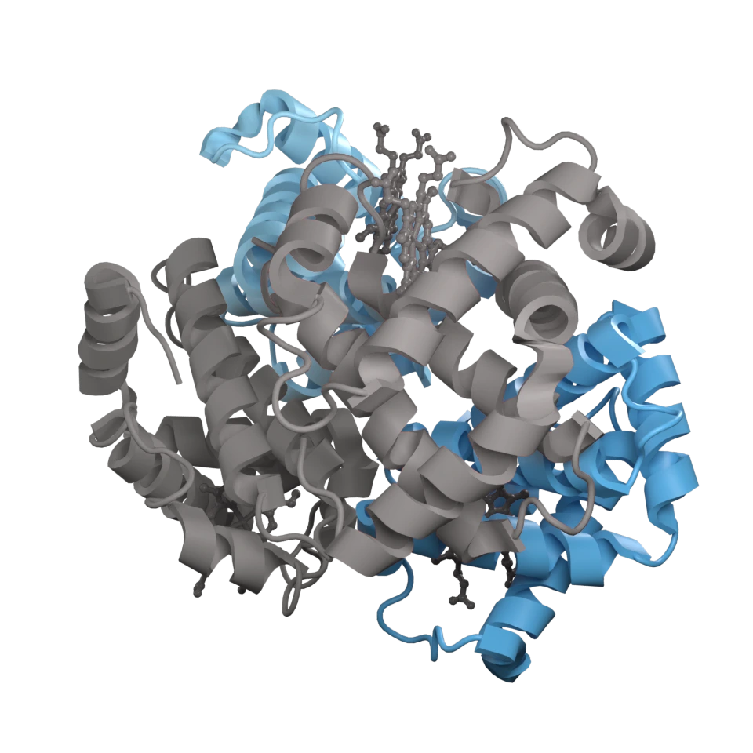
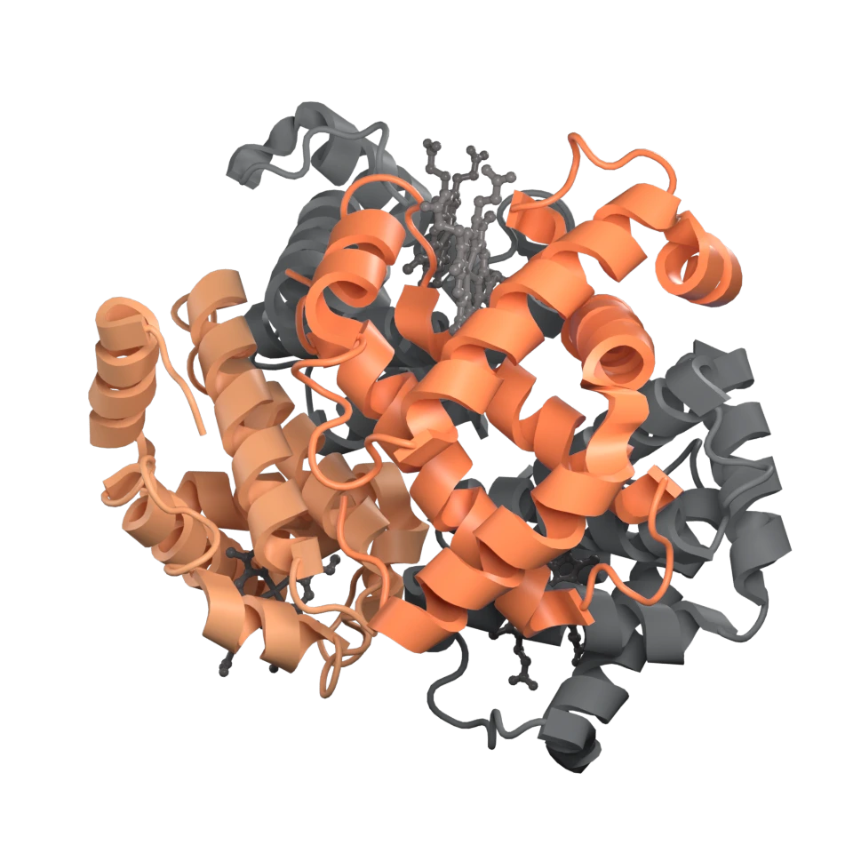
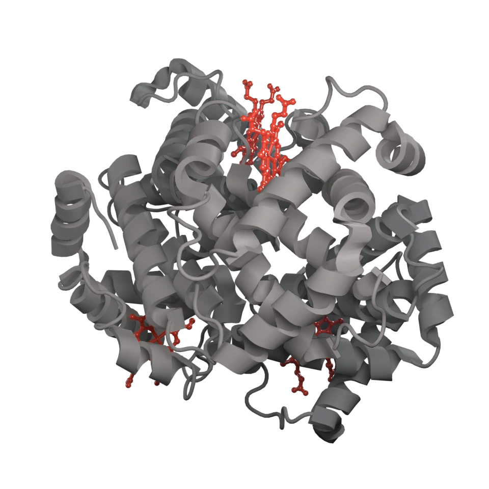
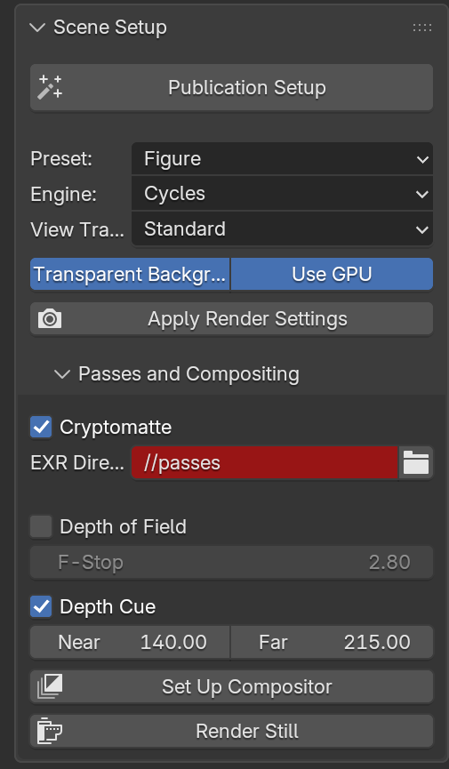

# Compositing and passes

## What compositing is

A render does not have to be one image. Cycles can be asked to write, alongside
the picture, several other pictures of the same frame: how far every pixel was
from the camera, which way its surface faced, and which object and material it
came from. Those are the **render passes**, and *compositing* is the step that
takes them and assembles the final image — brighten this, blur that, fade the
back of the scene, put the two together.

Blender has a compositor built in, and it runs after Cycles finishes. That
timing is the whole point: anything done in the compositor can be changed and
looked at again in a second, whereas anything baked into the 3D scene means
another full render.

For a molecular figure the useful consequence is that decisions you would
normally have to make *before* a 40-minute render — which chain the figure is
about, how much of the background to keep, where the focus falls — become
decisions you make *after* it, from the same render, as many times as the
figure needs.

## What cryptomatte is

A matte is a per-pixel mask: white where the thing you want is, black
elsewhere, and something in between at the edges where the pixel was only
partly covered. Given a matte you can treat one part of a finished image
differently from the rest.

**Cryptomatte** is how a renderer hands you those masks for everything in the
scene at once, without deciding in advance what you will want. During the
render, Cycles records for each pixel which objects, materials and assets
contributed to it and by how much — several such *ranks* per pixel, which is
what lets it get thin, semi-transparent and anti-aliased edges right rather
than stair-stepping them. The names are stored as hashes plus a manifest that
maps them back, so afterwards you can ask for "the pixels that came from *this*
material" by name and get a clean, edge-accurate matte for it.

Three layers are written, and which one you want depends on how the scene is
built:

| Layer | Selects by | Use it when |
| --- | --- | --- |
| `CryptoObject` | Blender object name | Separating a molecule from another molecule, or from measurement geometry |
| `CryptoMaterial` | material name | Separating parts *within* one molecule — chains, ligand, site |
| `CryptoAsset` | asset name | Grouping several objects under one name |

!!! important "One molecule is one object"

    Molecular Nodes puts an entire structure — every chain, every ligand — in a
    single Blender object, so `CryptoObject` cannot tell one chain from
    another: they are all the same object. Per-chain mattes come from the
    material layer, which means each chain has to be drawn by its own style
    with its own material:

    ```python
    mask = gala.select(mol, "chain A")
    mol.store_named_attribute(          # styles select by named attribute
        mask, name="chain_A",
        atype=databpy.AttributeTypes.BOOLEAN,
        domain=databpy.AttributeDomains.POINT,
    )
    material = gala.scene.materials.build_material("protein", name="GALA alpha 1")
    mol.add_style("cartoon", selection="chain_A", material=material)
    ```

    Vignette 5 does exactly this for the four chains of haemoglobin.

## Passes

```python
gala.enable_passes(
    cryptomatte=True,   # object, material and asset
    depth=True,         # Z
    normal=True,        # also improves denoising
    mist=False,
    cryptomatte_levels=6,
)
```

Six cryptomatte levels handles the semi-transparent edges of a molecular
surface; fewer produces fringing there.

## The compositor chain

```python
gala.setup_compositor(
    denoise=True,
    cryptomatte=True,
    dof=False,
    depth_cue_range=None,
    exposure=0.0,
    contrast=0.0,
    file_output="passes/",
)
```


Every node Gala adds is named with a `GALA` prefix and removed before
rebuilding, so calling this repeatedly rewires rather than accumulating
duplicates. Nodes you added yourself are left alone.

Blender 5 moved the scene compositor into a reusable node group and replaced
several `CompositorNode*` types with unified `ShaderNode*` ones. Gala targets
that generation only — the minimum supported Blender is 5.1 — and CI runs the
suite on the oldest supported release and the current one, so a later rename
shows up as a failure rather than a silently skipped step.

### Cryptomatte nodes are deliberately unconnected

`setup_compositor` adds a `CryptomatteV2` node per layer, ready to pick with,
but does not link one to the output. Connecting one would matte the beauty
pass, which defeats the point of shipping mattes.

Each is already pointed at its own layer, so the one labelled *CryptoMaterial*
matches material names. To pick interactively, put the render in the backdrop
and use the node's eyedropper: clicking a chain writes its material name into
*Matte ID*, which is the same string you would pass to
[`highlight_matte`](#highlighting-one-part-of-a-finished-render) in a script.

## Writing the passes

```python
gala.setup_compositor(cryptomatte=True, file_output="passes/")
```

adds a File Output node writing a **32-bit multilayer EXR** with Image, Depth,
Normal and every cryptomatte layer. That is the format Nuke, Fusion, Krita and
Blender's own compositor read cryptomatte from; a PNG cannot carry it. The
manifest that maps the hashes back to names travels in the file, so the mattes
are still selectable by name on another machine, in another application, a year
later.

Alternatively, make the render output itself a multilayer EXR, which captures
every enabled pass without needing a File Output node:

```python
gala.scene.set_exr_output("render/figure.exr")
gala.render()
```

## Highlighting one part of a finished render

`highlight_matte` builds the graph that a matte is *for*: the named chain,
ligand or subunit keeps its colour and brightness, and everything else is
darkened and drained of colour so it reads as context.

```python
gala.highlight_matte("GALA alpha 1", layer="material")
```

Point it at an EXR and it does that without rendering anything again — the
image and its mattes are both read from the file, so a scene with no molecule
in it is enough to produce the picture:

```python
gala.highlight_matte(
    ["GALA beta 1", "GALA beta 2"],
    source="passes/gala.exr",
    dim=0.75,        # how far the rest is darkened, 0-1
    desaturate=0.9,  # how much colour it loses, 0-1
)
```


The nodes are Gala-prefixed like the rest, so re-running replaces the knock-back
rather than stacking another one on it, and `clear_compositor` removes it.

Three figures from one render of haemoglobin, differing only in the name passed
to `highlight_matte`:

<div class="grid cards" markdown>

- 

    **The render.** Two alpha subunits in blue, two beta in orange, four hemes
    in red.

- 

    `highlight_matte(["GALA alpha 1", "GALA alpha 2"])`

- 

    `highlight_matte(["GALA beta 1", "GALA beta 2"])`

- 

    `highlight_matte("GALA heme")`

</div>

Nothing in the 3D scene moved between them, so the four images are
interchangeable on a slide: same lighting, same framing, same colours, and no
second render.

## Depth of field

Two ways, with different trade-offs.

**Physical camera DOF** traces a real aperture, so out-of-focus highlights
behave correctly and there is no edge bleeding. It costs samples:

```python
gala.depth_of_field(mol, fstop=2.8)
```

Focusing on an object rather than a distance means the focus follows it through
an animation.

The focus lands on the target's *origin*, which for a molecule whose origin has
been moved to its centroid is the middle of the whole protein. At these
apertures that is several ångström off whatever you meant to look at, so name
it:

```python
gala.depth_of_field(mol, selection="ligand", fstop=4.0)
```

That parks a `GALA Focus` empty on the middle of the selection and focuses on
that, so the focus still tracks — and `clear_all` removes it with everything
else Gala made.

!!! note "F-stops at molecular scale"

    One ångström is 0.01 Blender units, so the depth of field is very shallow.
    Values around f/2.8–8 are a starting point, not an answer — check the
    result rather than trusting the number.

**Compositor defocus** uses the Z pass, is far cheaper, and can be adjusted
after the render:

```python
gala.setup_compositor(dof=True, dof_fstop=4.0)
```

## Depth cueing

Fading the image towards the background with depth is the classic way of
keeping a crowded binding site readable — PyMOL's `depth_cue`:

```python
gala.depth_cue(near=140.0, far=215.0)   # angstrom from the camera
```

{ width="380" }

Geometry at `near` is untouched; geometry at `far` fades fully into the
background. The range is measured from the camera, so it has to bracket where
the molecule actually is — a range that stops short of it fades the whole frame
and looks like a broken render.

!!! note "Depth cueing costs the transparent background"

    What the far end fades *into* is the world colour, and the background is
    at the far end too, so a depth-cued figure arrives opaque where an
    untouched one has a usable alpha channel. It is also the one adjustment
    here that needs the Z pass at render time rather than working from the EXR
    afterwards.

## From the sidebar

The same options live in **Scene Setup ▸ Passes and Compositing**, with a
*Set Up Compositor* button that calls `setup_compositor` with them:

{ width="300" }

The EXR directory shows red because its default, `//passes`, is relative to the
.blend file — Blender marks relative paths in these fields. It is not an error.

## Cleaning up

```python
gala.scene.clear_compositor()
```
