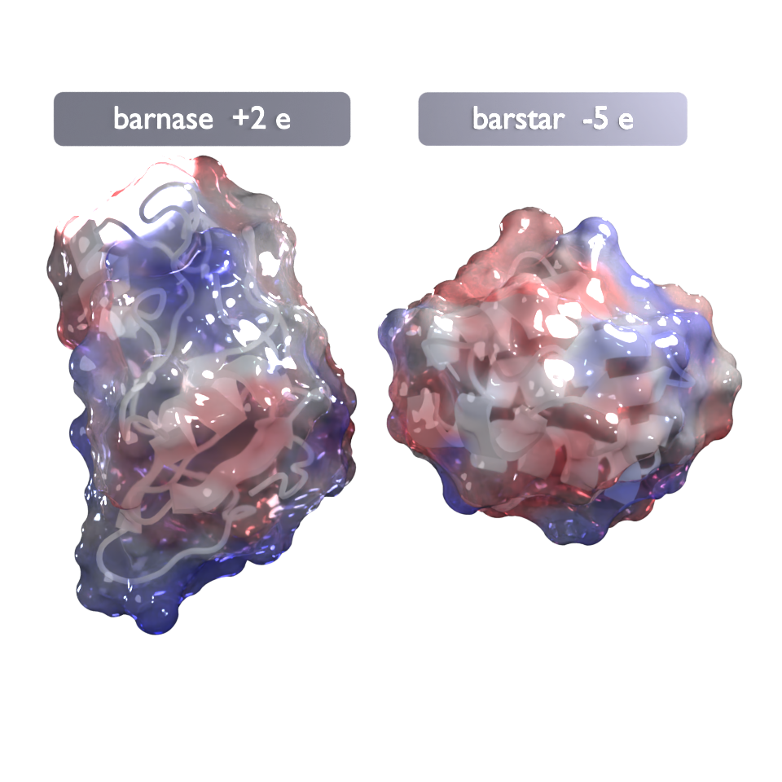

# Electrostatics

Gala runs [APBS](https://www.poissonboltzmann.org) the way the [PyMOL APBS
plugin](https://pymolwiki.org/index.php/Apbsplugin) does — PDB2PQR assigns
charges and radii, APBS solves the Poisson–Boltzmann equation on a grid — and
paints the result onto a translucent molecular surface.

```python
import blender_gala as gala

surface = gala.electrostatic_surface(mol, ramp=5.0, alpha=0.6)
print(surface.summary())
```

That single call does four things: writes the structure out as PDB, runs
PDB2PQR and APBS on it, reads the potential back, and colours a Molecular
Nodes surface style by it — red where the potential is negative, white at
zero, blue where it is positive.



## Getting APBS

APBS and PDB2PQR are separate programs and Gala does not bundle either; it
shells out to whatever is on `PATH`. Both install with pip:

```console
$ pip install apbs-binary pdb2pqr
```

If they are somewhere else, point `GALA_APBS` and `GALA_PDB2PQR` at them, or
pass `apbs_path=` and `pdb2pqr_path=`. In this repository, `make apbs` puts
both in `.venv` and `make vignettes` finds them there.

Without them you get one error that says exactly this, rather than a traceback
from a missing file.

## What the calculation is

Every setting that changes the answer is an argument, not a dialog box:

```python
run = gala.run_apbs(
    mol,
    forcefield="AMBER",      # PDB2PQR's charges and radii
    ph=7.4,                  # optional; assigns protonation states with PROPKA
    ionic_strength=0.15,     # mol/L of monovalent salt
    pdie=2.0, sdie=78.54,    # solute and solvent dielectrics
    temperature=298.15,      # K
    solver="lpbe",           # or "npbe" for the non-linear equation
)
print(run.net_charge, run.grid.shape, run.workdir)
```

The grid itself is sized by PDB2PQR, which knows how to fit a `mg-auto` box
around a molecule; Gala edits the rest of the input file it generates rather
than writing one from scratch, so what APBS actually ran is readable next to
its output in `run.workdir`. Nothing there is deleted — a run takes long
enough that throwing away the PQR and the logs is rarely what you want.

An already-computed map skips all of it:

```python
grid = gala.read_dx("mymap.dx")          # or .dx.gz
gala.electrostatic_surface(mol, grid=grid)
```

## Where the potential is read

The potential at an atom's centre is not the potential at the surface. Inside
the solute the field is dominated by that atom's own partial charge — hundreds
of kT/e, and every carbonyl would come out red regardless of what the molecule
as a whole is doing.

So Gala reads it where the surface is. Each atom gets a set of points on its
solvent-accessible sphere — radius *r*<sub>vdW</sub> + probe, the same
construction Shrake and Rupley use for SASA — the points covered by
neighbouring atoms are discarded, and the value is the mean over what is left.
An atom whose points are all covered is buried, has no surface to colour, and
gets `nan` rather than a number read from inside the protein.

```python
values = gala.potential_at_atoms(mol, grid, probe=1.4, points=32)
```

Molecular Nodes then does the rest: the surface style is set to take its
colour from the nearest atom, so each patch of surface carries the value that
belongs to it.

## The ramp

`ramp` is where the colour saturates, in kT/e, symmetric about zero because
the sign is the whole point. ±5 is the conventional choice and the one the
PyMOL plugin opens with; small, mostly-neutral proteins often want ±3, and a
nucleic acid or a strongly charged complex wants more. It is a display choice,
so quote it in the caption — `surface.summary()` prints it along with the
range actually present and how much of the surface saturates:

```
Electrostatic surface
  ramp     : -3 to +3 kT/e (red to blue)
  surface  : -14.27 to +14.24 kT/e, mean +0.67
  beyond   : 6.3% of atoms saturate the ramp
```

## Transparency, and glass

There are two ways to see through the surface, and they are not the same
picture.

`material="surface"` (the default) is **alpha blending**: the surface is mixed
with whatever is behind it, `alpha` says in what proportion, and it costs
almost nothing to render. Use it when the figure is about the map.

```python
gala.electrostatic_surface(mol, alpha=0.6)
```

`material="glass_surface"` is **transmission**: the shell refracts. The
cartoon under it bends as it moves, the rim picks up total internal
reflection, and light that crosses the shell can be focused onto what is
inside. This is the part a rasterised viewer cannot do at any setting, because
there is no light path there to follow.

```python
gala.electrostatic_surface(
    mol,
    material="glass_surface",
    material_options={"roughness": 0.06, "color_mix": 0.62,
                      "transmission_weight": 0.85},
    style_options={"probe_size": 2.2, "relaxation_steps": 40},
)
```

Three settings there are worth knowing, because glass punishes the defaults:

- **`color_mix`** dilutes the potential colour towards white. Light crossing
  coloured glass is tinted going in and again coming out, so a saturated ramp
  turns the inside of the surface into a dark gemstone.
- **`transmission_weight`** a little short of 1 leaves a diffuse fraction. A
  perfect refractor shows its colour only where light grazes it — the rim —
  and the ramp stops reading straight on.
- **`style_options`** smooth the shell. At the default probe every atom is a
  bump, and in glass every bump is a lens with its own highlight; the figure
  comes out as wet gravel. A wider probe and more relaxation give one surface
  instead of three hundred lenses.

Glass also wants an environment to refract — `lighting_style="both"` puts a
studio HDRI under the three-point rig — and it wants more light than an opaque
molecule, since what reaches the interior has crossed the shell twice.

## Caustics

Cycles will not show a caustic unless it is asked three times over, which is
what [`enable_caustics`][blender_gala.scene.render.enable_caustics] does:

```python
gala.enable_caustics(casters=[surface_mol], receivers=[cartoon_mol])
```

- the renderer's caustic paths are off by default;
- the glossy filter blurs what does get through, which is what turns a caustic
  into a smudge, so it is set to zero;
- and manifold next event estimation, the shortcut that makes caustics
  affordable, only runs between an object told it is the caster and one told
  it is the receiver — which is why the surface and the cartoon under it have
  to be **separate objects**, one molecule each.

Call it after the scene is set up: until the lights exist there is nothing to
allow. On the barnase figure it changes 19% of the pixels and brightens the
interior by about 1%, all of it light that arrived by refraction.

Caustics are the noisiest thing in a frame and the last to converge, so budget
samples for them — the vignette quadruples the preset's.

## What this is not

- **Not a substitute for reading the APBS documentation.** The defaults here
  are reasonable for a soluble protein at physiological salt. A membrane
  protein, a nucleic acid or anything with an unusual metal centre deserves an
  input file you have looked at.
- **Not per-vertex.** The potential is read per atom, in the way described
  above, and the surface interpolates between atoms. It is the same
  correspondence PyMOL's `ramp_new` and `set surface_color` produce.
- **Not a free energy.** A potential map says where the field is, not what
  binding will cost.
