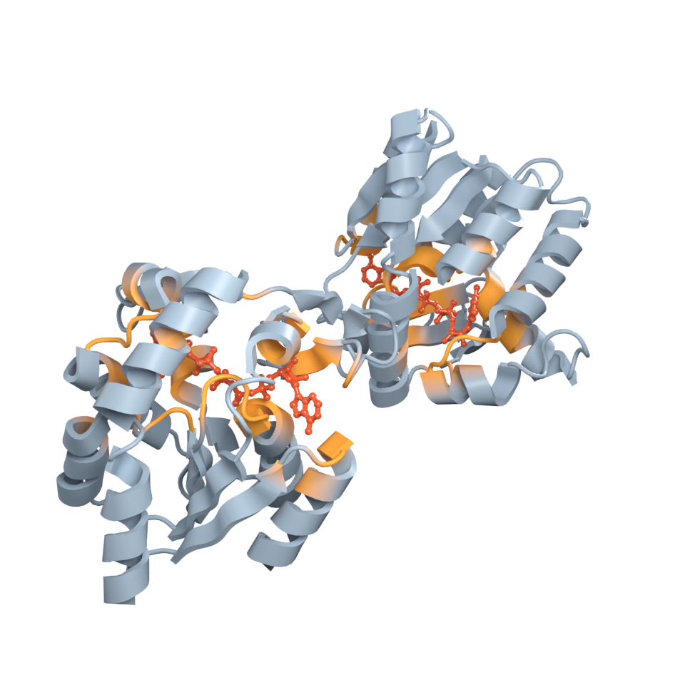

# PyMOL sessions

Most structural biologists arrive with a folder of `.pse` files. Gala reads
and writes them directly, so a session becomes a Blender scene and a Blender
scene becomes a session:

```python
import blender_gala as gala

result = gala.load_session("figure.pse")
print(result.summary())

gala.save_session("from_blender.pse")
```



Without writing Python, the same two are in **File ▸ Import ▸ PyMOL Session
(.pse)** and **File ▸ Export ▸ PyMOL Session (.pse)**, and in the sidebar under
**Gala ▸ PyMOL Session**. Each opens a file browser with its own options: which
state to build, and what to bring across.

{ width="250" }

## No PyMOL required

A `.pse` is a pickled tree of plain Python lists — that is the whole format.
Gala parses it rather than shelling out, which it has to: Blender's
interpreter has no PyMOL in it, and asking someone to install one to open
their own figure would defeat the exercise.

The format was read off sessions written by PyMOL 3.1.8 at every
`pse_export_version` from 1.7 to 3.0, and the fixture the tests run against is
one PyMOL wrote.

!!! warning "A session is a pickle, and a pickle can run code"

    Unpickling executes whatever the file names. Gala's reader refuses every
    global except the handful a genuine session contains, so opening a `.pse`
    that came by email cannot import `os` and call it. The allowed list is
    `ALLOWED_GLOBALS` in
    [`blender_gala.pymol.session`](../api/pymol.md), and it holds seven names.

## What comes across

| PyMOL | Blender |
| --- | --- |
| molecular object | a Molecular Nodes molecule |
| cartoon, ribbon, surface, sticks, spheres | the matching MN style, on the atoms that were shown in it |
| sticks *and* spheres over the same atoms | one **ball-and-stick** style — PyMOL has no such representation, it draws both and shrinks the spheres |
| lines, nonbonded | sticks and spheres, thinner — MN has no line representation |
| per-atom colour | the `Color` attribute, so every style shows the session's colours |
| secondary structure | MN's `sec_struct`, so helices stay helices |
| atom labels | Gala label objects |
| distance, angle, dihedral | Gala measurements, drawn, with values sized to the frame rather than to a fixed number of ångström |
| named selection | a boolean attribute of the same name |
| group | a collection |
| object matrix | the object's world matrix |
| the view | the scene camera |

Maps, meshes, CGOs and ramps have no equivalent and are listed in
`result.skipped` rather than dropped in silence.

## What is added

A session has no lighting and no materials in it — PyMOL has neither to
carry — so an import that stopped at the geometry would open correct and
unlit, and render black. Loading therefore finishes the scene:

```python
gala.load_session(
    "figure.pse",
    lighting="three_point",   # or "hdri", "both", "none"
    materials="chemistry",    # or None to leave MN's own alone
    light_energy=1.0,
)
```

The rig is sized from the molecules and built before the measurements and
labels, so a label standing off to one side does not push the lights outwards.
The materials take their colour from the mesh, so the session's per-atom
colours are kept — what a scheme decides is the surface that colour is shown
on: a cartoon matte, a ligand glossier, a surface softer.

The camera is *not* re-framed: the session's view is the one you set in PyMOL,
and framing it again would throw that away.

```python
result = gala.load_session("figure.pse", state=0, styles=True, colors=True)
print(result.molecules["1ake"])       # the Molecular Nodes molecule
print(result.styles["1ake"])          # ['cartoon', 'sticks']
print(result.skipped)                 # what did not come across
```

A named selection becomes a boolean attribute, which is exactly what a
Molecular Nodes style takes as its selection — so a pocket picked in PyMOL can
drive a surface in Blender without being picked again.

## Reading a session without opening Blender

The format layer imports nothing but numpy, so a session can be inspected from
any interpreter:

```python
from blender_gala.pymol import read_session

session = read_session("figure.pse")
for molecule in session.molecules:
    print(molecule.summary())
    print(molecule.rep_mask("cartoon").sum(), "atoms in the cartoon")
    print(session.atom_colors(molecule))     # (n, 4) RGBA
```

Coordinates are ångström, in the frame PyMOL held them in.
[`to_atom_array`][blender_gala.pymol.session.PymolMolecule.to_atom_array]
builds a biotite `AtomArray` when biotite is available.

## Writing one out

```python
gala.save_session(
    "out.pse",
    molecules=None,              # every MN molecule in the scene
    selections=["pocket"],       # boolean attributes to write as selections
    colors=True, styles=True, camera=True,
)
```

Coordinates are written in **world** space, so a molecule dragged across the
scene arrives in PyMOL where it looks in Blender rather than back where its
file put it.

Colours go across per atom. One that is exactly a PyMOL colour is written as
that colour's index, so a chain painted `skyblue` comes back as `skyblue`
rather than as an anonymous copy; the rest are defined in the session itself.
The round trip is within 1/255, because the colour table is stored as 8-bit.

Blender's colour attributes are **linear** and PyMOL's values are display
values, so the conversion happens at the boundary in both directions. It is
not a detail you can skip: without it every exported colour arrives in PyMOL
visibly darker than it looked in Blender, and none of them match the built-in
colour they came from.

**What is not written:** materials, lighting, node trees, compositing, and any
geometry that is not a molecule. Those are the parts of a Blender scene PyMOL
cannot hold — and mostly the reason for being in Blender at all. The session
carries the science; the render stays here.

## Things worth knowing

**Secondary structure travels with the session, not the coordinates.** PyMOL
assigns it when a structure is loaded and then takes a session at its word.
Gala carries the assignment both ways, so a helix stays a helix; without that
every cartoon arrives as a loop, in both directions.

**A style limited to a selection is read back where it can be.** Molecular
Nodes drives that from a named attribute, which Gala resolves. When a
selection is wired some other way it cannot be resolved, and the style is
written over every atom — said out loud in `result.skipped`, because sticks
spreading to a whole protein is very visible.

**`pse_binary_dump` is refused.** With that setting on, PyMOL stores raw C
structs whose layout changes between builds. Gala will not guess at it and
says so; in PyMOL, `set pse_binary_dump, 0` and re-save. It is off by default,
so this is rare.

**Multi-state objects build one state at a time.** `state=` picks it, and an
atom with no position in that state is left out rather than placed at the
origin. A session can also hold atoms it has no coordinates for at all; those
are left out too, and how many is reported in `result.skipped`, since the
molecule that arrives is then smaller than the one the session lists.

## What this is not

- **Not a PyMOL emulator.** Representation settings — stick radius, cartoon
  style, transparency — are read where Gala has somewhere to put them and
  otherwise left behind. The geometry, colours and camera are the contract.
- **Not a way to render PyMOL figures in PyMOL.** The point of bringing a
  session into Blender is everything Blender does afterwards.
- **Not lossless in the Blender direction.** See the list above; the session
  is a molecular format, and a Blender scene is not.
