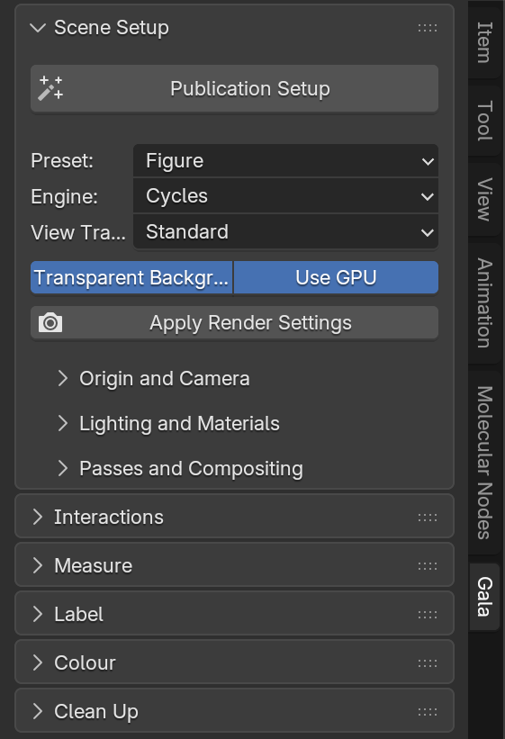
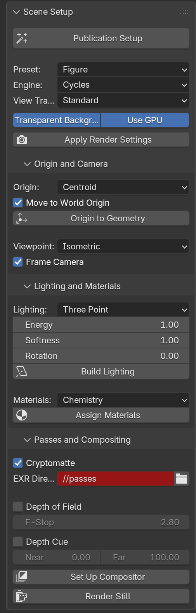
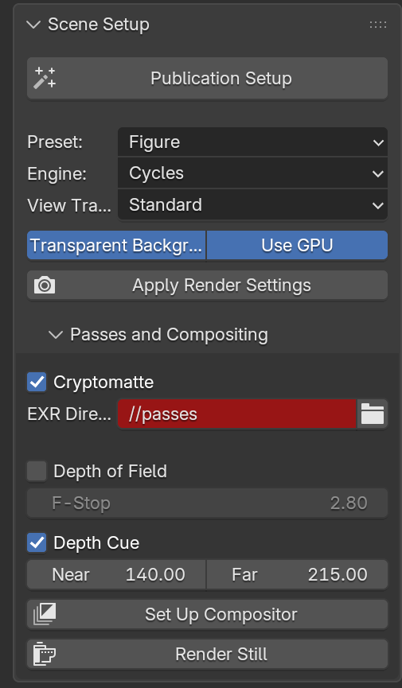
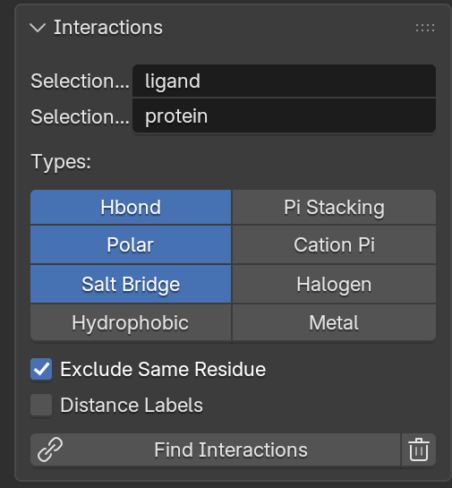
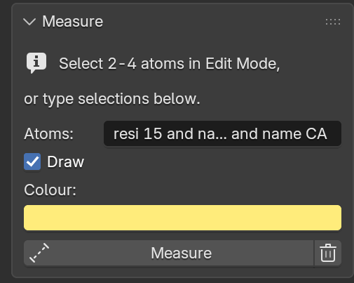
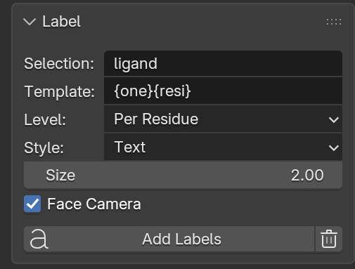
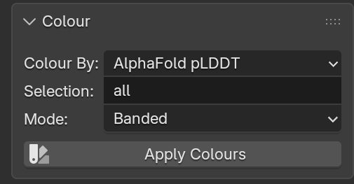
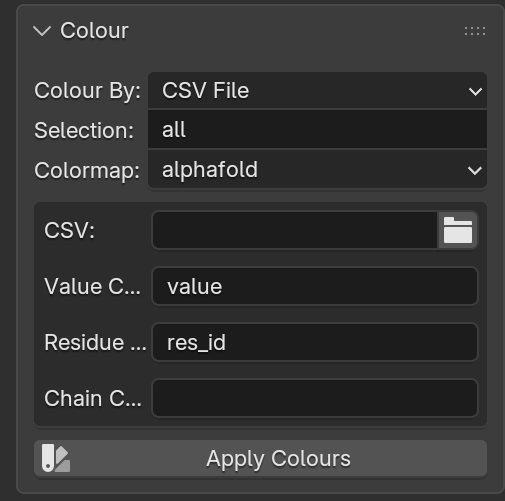
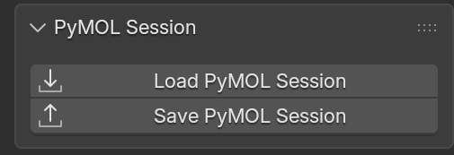

# The Blender UI

Everything Gala does is available from a **Gala** tab in the 3D View sidebar
(`N`). The panels are a thin shell: each operator validates its context and
calls exactly one Python API function, so nothing is available in the UI that
is not scriptable, and vice versa.

{ width="280" }

## Panels

### Scene Setup

The one-click **Publication Setup** button, plus the preset, engine and view
transform it will use. After a run, the status bar reports which GPU backend
was found.

Sub-panels:

- **Origin and Camera** — origin method, whether to move to the world origin,
  and the camera viewpoint.
- **Lighting and Materials** — three-point or HDRI, energy, softness, rig
  rotation, and the material scheme.
- **Passes and Compositing** — cryptomatte, the EXR output directory, depth of
  field, depth cue, and a *Render Still* button.

{ width="250" }

The EXR directory shows red because its default, `//passes`, is relative to the
.blend file — Blender marks relative paths in these fields. It is not an error.

{ width="250" }

*Set Up Compositor* builds the node graph shown in the
[compositing guide](compositing.md); *Render Still* renders through it.

### Interactions

Two selection fields and a grid of interaction types. *Find Interactions*
detects and draws them; the trash button clears them.

{ width="250" }

### Measure

Select 2–4 atoms in Edit Mode and press *Measure*: Gala picks distance, angle
or dihedral from how many you selected. Or type selection strings separated by
`;` to do the same without leaving Object Mode.

{ width="250" }

### Label

Selection, template, level, style and size. The template accepts `{chain}`,
`{resi}`, `{resn}`, `{one}`, `{name}`, `{elem}`, `{b}` and `{q}`.

{ width="250" }

### Colour

AlphaFold pLDDT, B-factor, or a CSV of per-residue values, with a colormap
picker. Choosing **CSV File** adds the column names to read it with.

=== "pLDDT"

    { width="250" }

=== "CSV file"

    { width="250" }

### PyMOL Session

*Load PyMOL Session* opens a `.pse` — molecules, representations, per-atom
colours, measurements and the camera. *Save PyMOL Session* writes the scene
back out as one.

{ width="250" }

Both open a file browser with their own options in its sidebar: which state to
build, and whether to bring across representations, colours, the camera, and
measurements and labels. Import also offers **Lighting** and **Materials**,
which finish the scene — a session carries neither, so without them the import
opens unlit and renders black.

The same two are in **File ▸ Import ▸ PyMOL Session (.pse)** and **File ▸
Export ▸ PyMOL Session (.pse)**, which is where the rest of Blender's formats
live and where someone handed a session tends to look first.

Neither needs PyMOL installed. See [PyMOL sessions](pymol.md) for what
survives each direction.

### Clean Up

*Clear All Gala Objects* removes everything Gala added — interactions,
measurements, labels, lights and compositor nodes — and leaves your molecule
and your own objects alone.

## How Gala organises the scene

Everything created goes into a `Gala` collection with one child per category:

```
Gala
├── Gala Interactions
├── Gala Measurements
├── Gala Labels
└── Gala Lighting
```

So a whole category can be hidden with one checkbox, excluded from a view
layer, or deleted as a unit. Objects also carry a `gala_type` custom property,
so they stay identifiable after you have moved them.

## Settings persistence

Panel settings live in a `PropertyGroup` on the scene (`bpy.context.scene.gala`),
so they survive save and reload, and two scenes in one file can be configured
differently.

```python
import bpy
props = bpy.context.scene.gala
props.preset = "print"
props.selection_a = "resn STI"
bpy.ops.gala.find_interactions()
```
