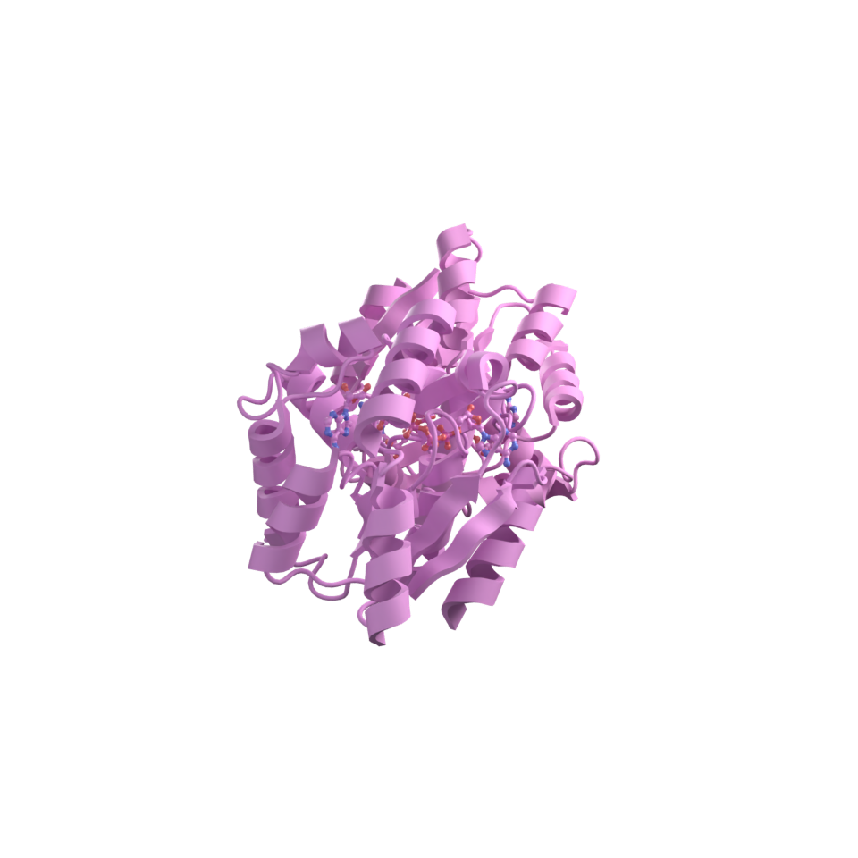
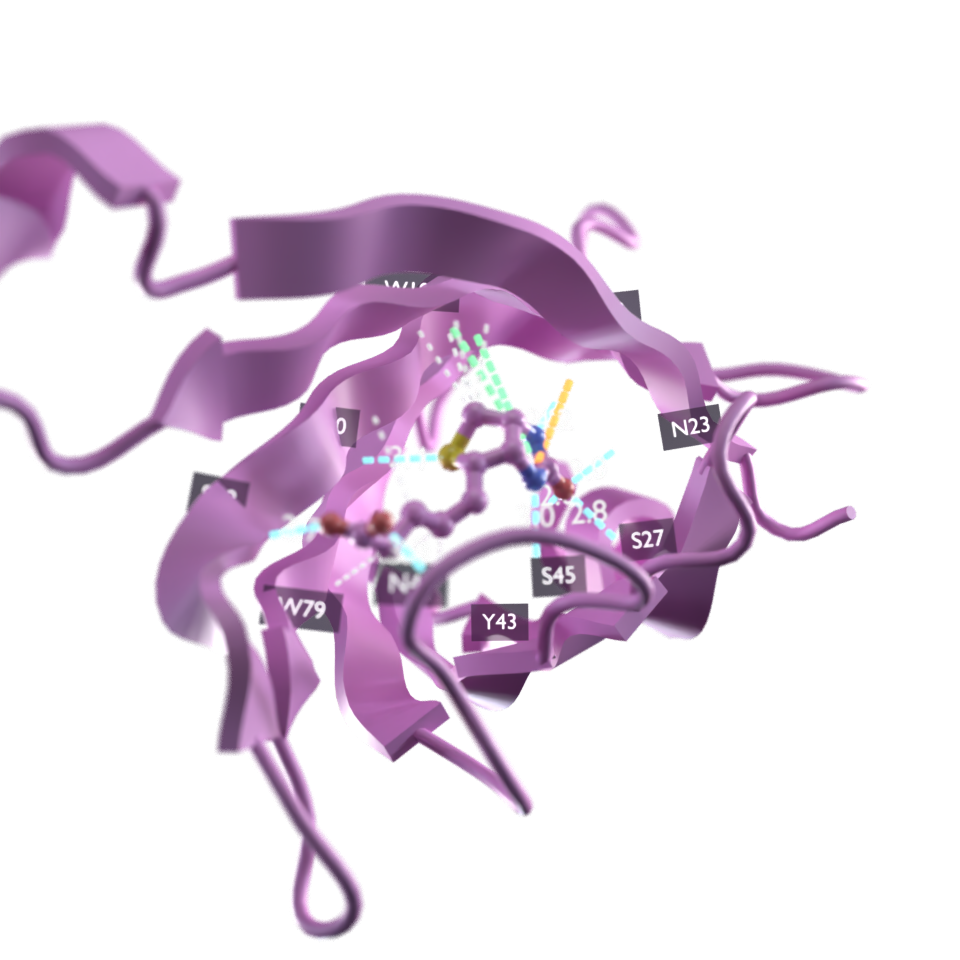
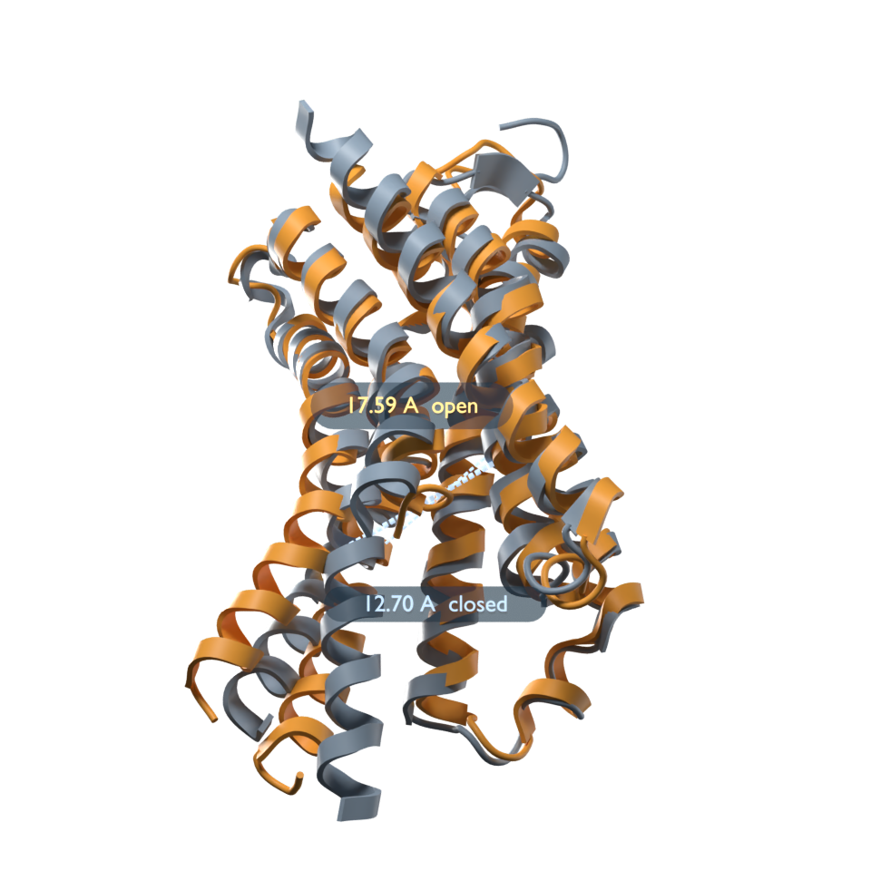
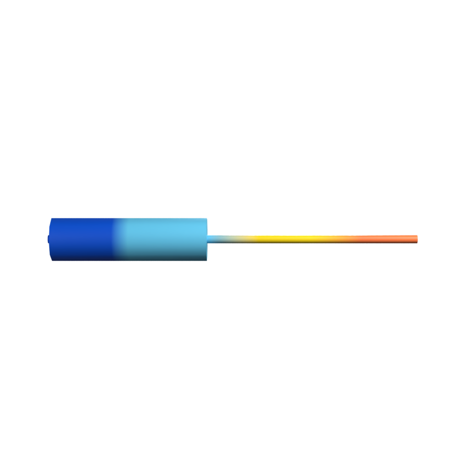
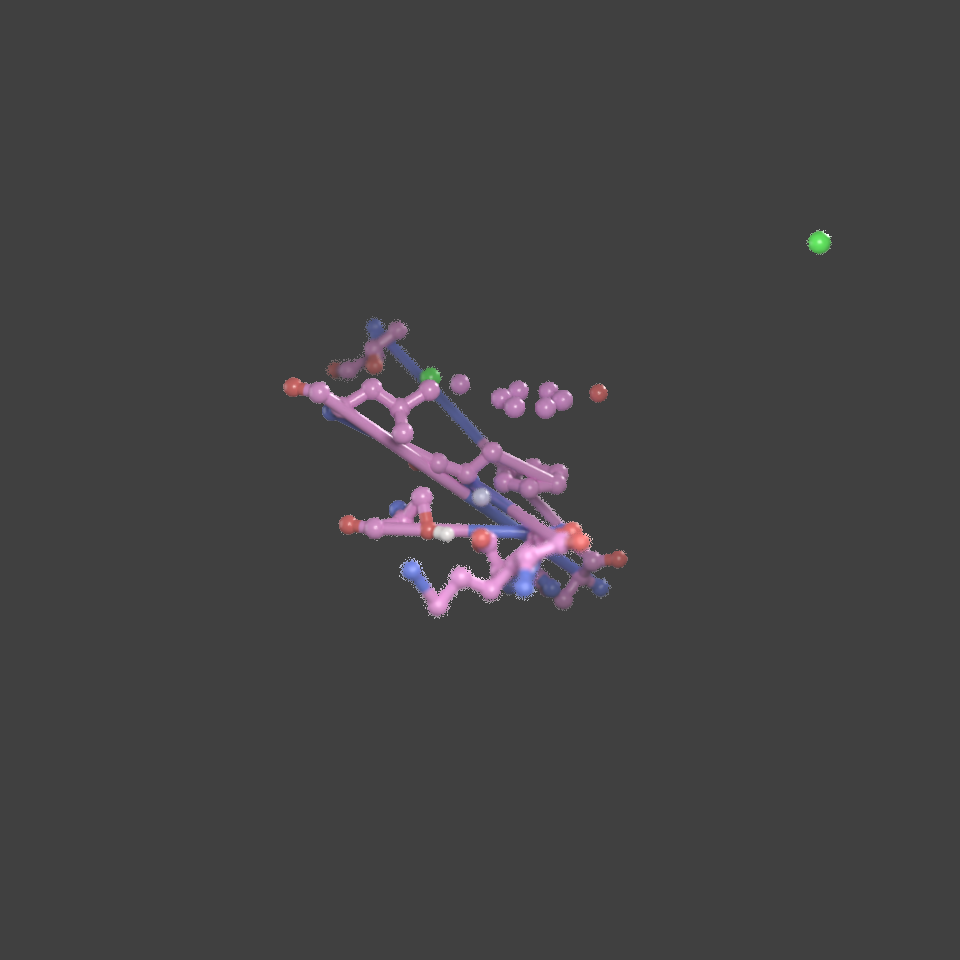
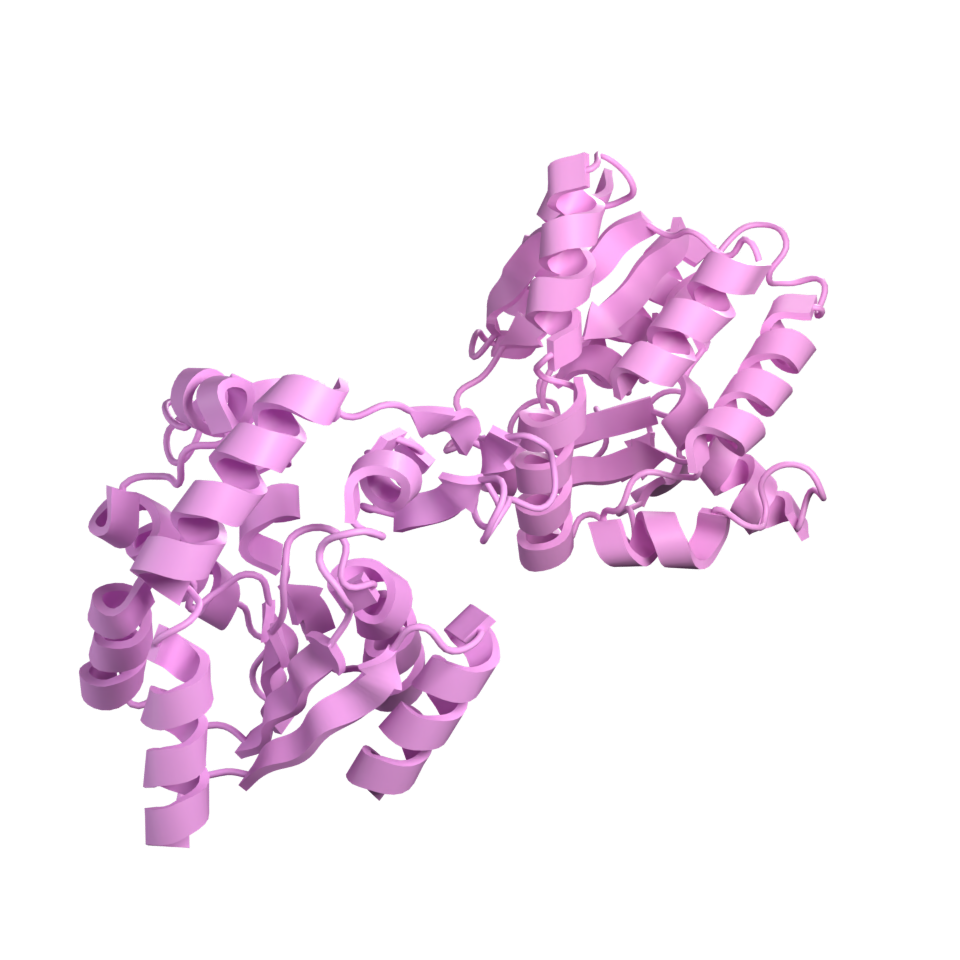

# Vignettes

Runnable end-to-end examples. Each is a standalone script in
[`vignettes/`](https://github.com/maomlab/blender_gala/tree/main/vignettes)
that CI executes on every push, so none of them can drift from the code.

Run one:

```bash
blender --background --python vignettes/01_publication_figure.py
```

or all of them:

```bash
make vignettes
```

They write their output into `docs/images/`.

## 1. A publication figure



`01_publication_figure.py` — load a structure, style it, and go from the
default scene to a transparent-background 300 dpi figure in one
`publication_setup` call. Shows the render preset, the lighting rig and the
report it returns.

## 2. A binding site



`02_binding_site.py` — find every interaction between a ligand and its pocket,
draw them as dashed lines, quote the polar distances, and label the closest
residues on translucent cards. The camera looks in along the direction the
pocket opens, computed from the structure, and frames the site rather than the
protein. The full Objective 2 workflow.

## 3. Measuring



`03_measurements.py` — a distance, an angle and a dihedral, drawn with arcs and
value labels, plus what happens when a selection is ambiguous.

## 4. AlphaFold confidence



`04_alphafold_confidence.py` — fetch human p53 from the AlphaFold database,
colour it by pLDDT with the official confidence bands, print the legend, and
render only the parts worth trusting. A real prediction rather than a fixture,
because the point of the bands is that confidence is uneven: p53's DNA-binding
core comes out dark blue and its disordered arms orange.

## 5. Compositing passes



`05_compositing_passes.py` — enable cryptomatte and Z, render to a multilayer
EXR, and set up depth of field and depth cueing so the figure can be adjusted
after the render.

## 6. A turntable



`06_turntable.py` — an orbiting animation with framing that holds for every
frame.
