# Vignettes

Runnable end-to-end examples. Each is a standalone script in
[`vignettes/`](https://github.com/maomlab/blender_gala/tree/main/vignettes)
that CI executes on every push, so none of them can drift from the code.

Run one:

```bash
blender --background --python vignettes/01_publication_figure.py
```

or all of them:

```bash
make vignettes
```

They write their figures into `docs/images/`.

Each one also ends by saving the scene it built, so the script is a starting
point rather than only a demonstration:

```bash
blender build/vignettes/01_publication_figure.blend
```

That file has the molecule, the styles and materials, the lighting rig, the
camera and the compositor in it, as ordinary Blender data — open it and move
the key light, re-frame the shot, or carry on in the Gala sidebar. Set
`GALA_VIGNETTE_BLEND_DIR` to save them somewhere other than `build/vignettes`.

## The core workflow

The eight that came first: everything in Objectives 1 and 2, each one the
shortest honest path through a job you would otherwise do by hand.

### 1. A publication figure

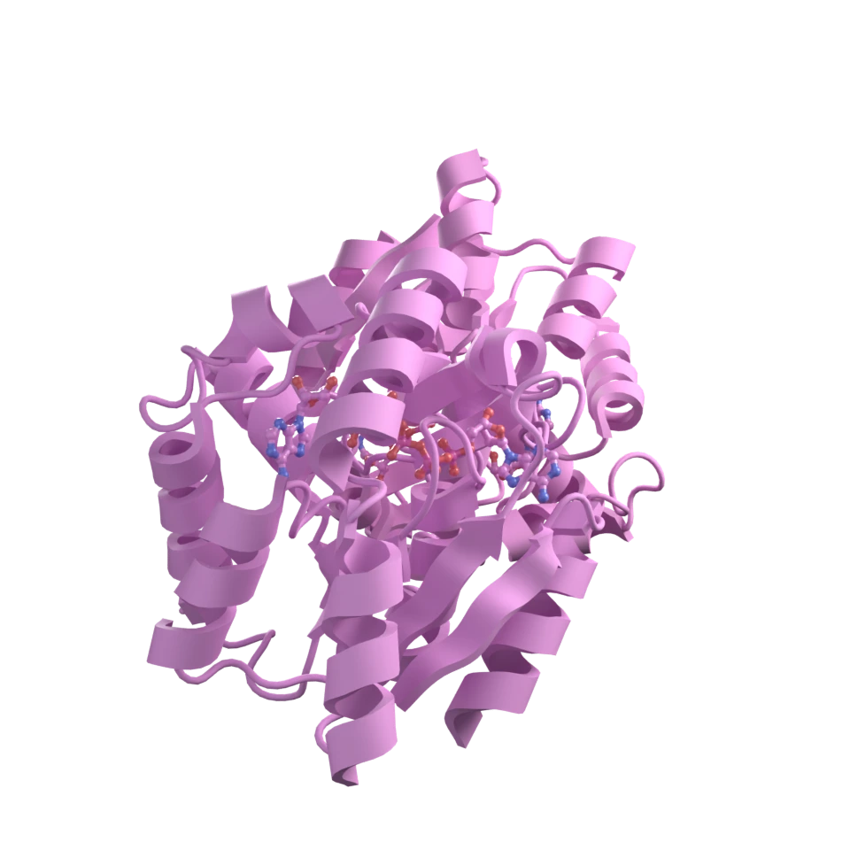

`01_publication_figure.py` — load a structure, style it, and go from the
default scene to a transparent-background 300 dpi figure in one
`publication_setup` call. Shows the render preset, the lighting rig and the
report it returns.

### 2. A binding site

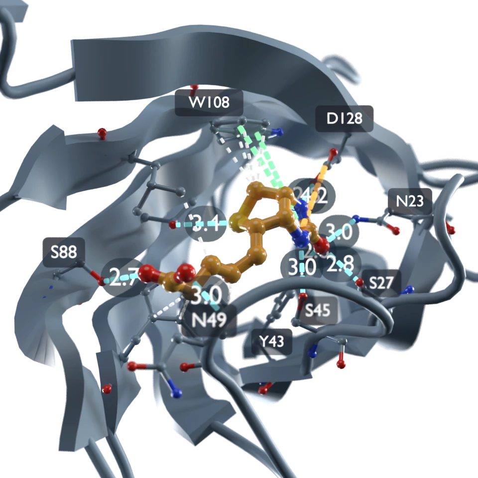

`02_binding_site.py` — find every interaction between a ligand and its pocket,
draw them as dashed lines, quote the polar distances, and label the closest
residues on translucent cards. A cool neutral protein against warm ligand
carbons, so the eye goes where the figure is about, and the contacting residues
as ball-and-stick at half the ligand's radii and coloured by element, so the
dashes land on atoms you can identify without competing with the ligand. The camera looks in along the direction the
pocket opens, computed from the structure, and frames the site rather than the
protein. The full Objective 2 workflow.

### 3. Measuring

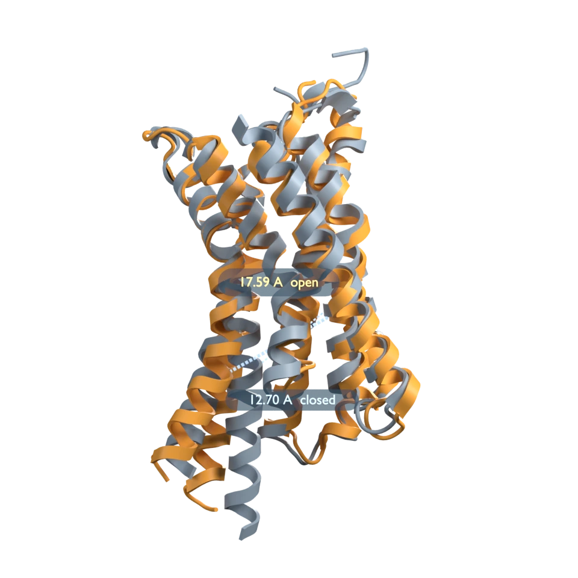

`03_measurements.py` — the distance that decides whether a GPCR is activated.
Aranda-García et al.
([Nat Commun 16, 2020](https://doi.org/10.1038/s41467-025-57034-y)) define the
state of a class A receptor by the distance between two alpha carbons, one on
TM2 and one on TM6, and give the thresholds that sort a structure into closed,
intermediate or open. The vignette measures exactly that on the adenosine A2A
receptor in both states — 5UIG with an antagonist bound, 6GDG coupled to
mini-Gs — superposing them with Kabsch onto a common frame first, so what is
left is the receptor's own motion: 12.70 Å closed, 17.59 Å open, TM6 out by
4.9 Å. Drawn in the paper's own orientation — a side view in the membrane
plane, helices vertical, TM6 on the left and TM2 on the right — built from the
bundle's principal axis rather than from whichever way the crystals point. It also shows what happens when a selection is ambiguous, and how
`measure` dispatches on two, three or four atoms to give a distance, an angle
or a dihedral.

### 4. AlphaFold confidence

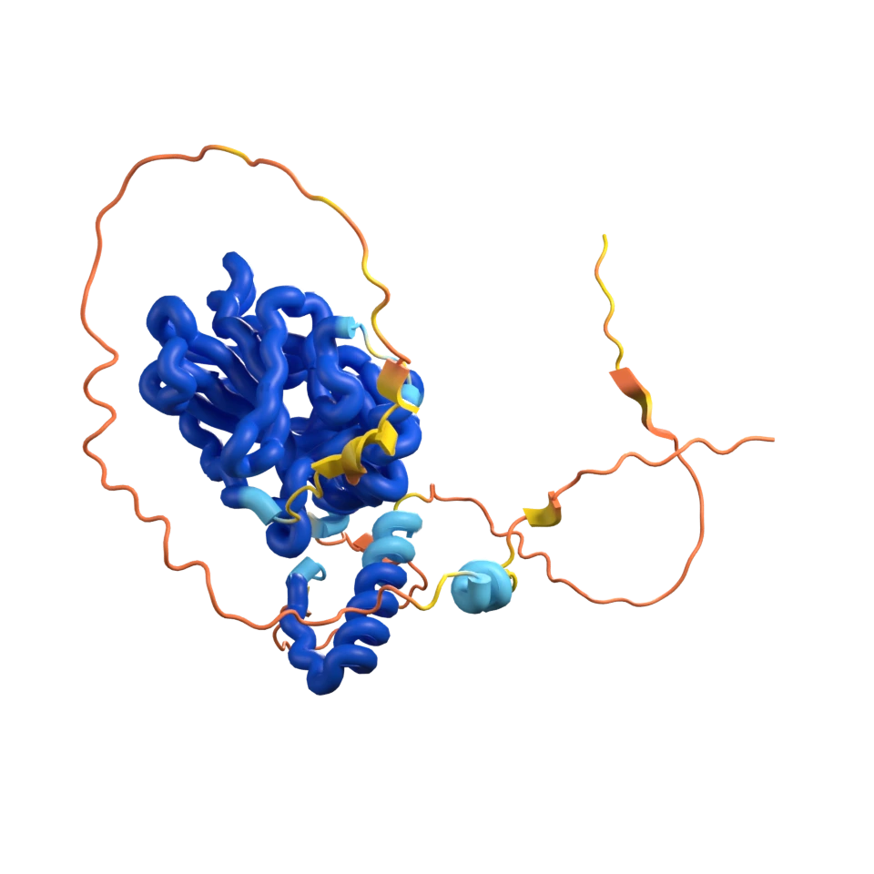

`04_alphafold_confidence.py` — fetch human p53 from the AlphaFold database,
colour it by pLDDT with the official confidence bands, print the legend, and
render only the parts worth trusting. A real prediction rather than a fixture,
because the point of the bands is that confidence is uneven: p53's DNA-binding
core comes out dark blue and its disordered arms orange.

### 5. Compositing passes


`05_compositing_passes.py` — haemoglobin rendered once, cut into four figures.
A talk needs the same picture with a different subunit carrying the argument
each time, and rendering it once per slide is three more chances for the
lighting or the framing to drift. So the vignette gives each chain its own
material — which is what lets cryptomatte tell them apart inside a single
Molecular Nodes object — enables the passes, and writes the render to a
multilayer EXR alongside the picture.

Everything after that is compositing. The alpha-subunit figure above, the beta
one and the heme one are all cut from that one render by
`highlight_matte`, in a scene with no molecule, no lights and no camera in it:
every pixel comes out of the EXR, and each figure costs a fraction of a second
rather than another pass through Cycles.

| The render | Beta subunits | The hemes |
| --- | --- | --- |
|  |  |  |

It also sets up depth of field, and renders the one variant that cannot be done
after the fact — depth cueing, which needs the Z pass at render time. The
[compositing guide](guide/compositing.md) shows the node graphs behind all of
it.

### 6. A turntable


`06_turntable.py` — an orbiting animation with framing that holds for every
frame. The camera is parented to a pivot at the molecule's centre and the
lights are not, so the structure turns *through* the light rather than being lit
identically from every angle, which is what makes its shape read.

The animation above is the turn itself — 60 frames at 25 fps, in WebP rather
than GIF so that it keeps a real alpha channel and the full colour range at a
fraction of the size. It is built by `make vignettes-turntable`, which is not part of
`make vignettes`: a hundred-odd Cycles frames is more than a smoke test on
every push should be doing.

### 7. Electrostatics

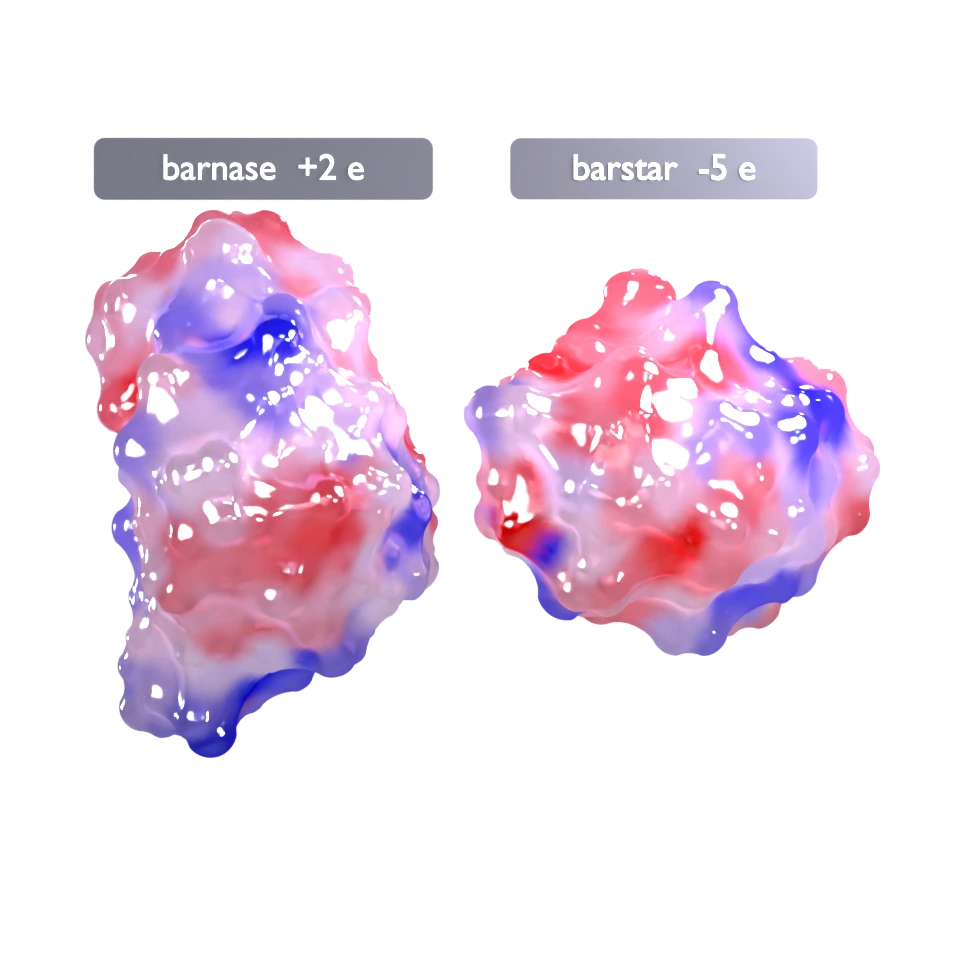

`07_electrostatics.py` — barnase and barstar, each solved on its own with
PDB2PQR and APBS, then opened out like a book so both binding faces are in
view. Barnase's is a patch of positive, barstar's is a patch of negative, and
the two are shaped like each other — which is why they associate as fast as
they do. The vignette also puts a number on it: the mean potential over each
partner's interface against the mean over the rest of its surface.

The surface is thin glass rather than an alpha-blended film, with the cartoon
underneath showing through it and refracted by it, and Cycles' caustics turned
on so the key light focuses through the shell onto the fold inside. That is
the argument for rendering a molecule in a path tracer rather than a viewer:
the same map, lit rather than drawn. Needs `apbs` and `pdb2pqr`;
`pip install apbs-binary pdb2pqr`, or `make apbs`.

### 8. PyMOL sessions

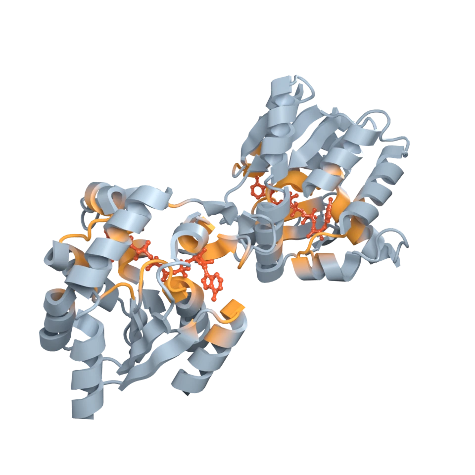

`08_pymol_session.py` — the round trip. It reads a session PyMOL itself wrote
(the one the tests use), reports what is in it without needing PyMOL
installed, then builds a scene of adenylate kinase, writes it out as a `.pse`,
clears everything, and rebuilds the scene from that file alone.

The figure above is the rebuilt one: the cartoon, the ligand, the binding-site
colouring and the camera all came back out of the session. The vignette checks
the round trip rather than asserting it — atom count, largest positional
drift, largest colour change, and whether the B-factors survived — and prints
what a session cannot carry, which is the lighting and materials that made it
worth opening Blender.

---

The eight above are Gala doing its own job. The eight below are Gala in a
scene with the rest of Blender in it — geometry nodes, the shader editor, the
animation system, the line renderer — because the reason to put a molecule in
Blender rather than in a viewer is that everything else in Blender is then
also available to it.

## Geometry nodes

Instancing is the reason a virus capsid, a bilayer or a cytoplasm is tractable
at all: one mesh, a list of transforms, and Cycles renders the copies without
storing them. Gala's framing and lighting read what geometry nodes actually
drew, instances included, so `frame_target` on a node-built scene fits the
scene rather than the handful of points it grew from.

### 9. A capsid, built by instancing

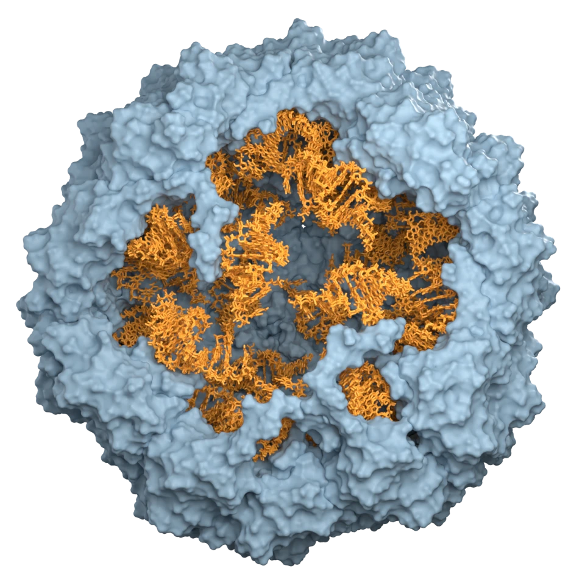

`09_capsid_assembly.py` — satellite tobacco mosaic virus, the smallest
icosahedral virus there is: sixty copies of one coat protein in a shell 170 Å
across, each clamped onto a piece of its own genome.

Molecular Nodes will build the assembly for you with `add_style(...,
assembly=True)`. This builds it the long way, from the sixty transforms the
PDB deposits, through a node tree of its own — because once the instancing is
yours you can decide *which* copies to draw. The subunits in the near cap are
simply never instanced, and the RNA, which has no such selection wired to it,
is still there underneath.

### 10. A membrane

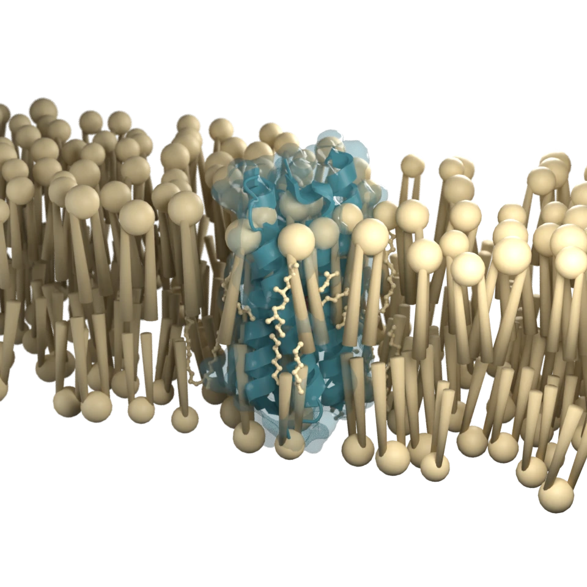

`10_membrane.py` — bacteriorhodopsin, put back in the bilayer its crystal
structure left out. The membrane is a thousand instanced lipids across two
leaflets, with a hole opened by a Geometry Proximity node measured against the
protein's own molecular surface, so the gap is the protein's footprint rather
than a circle that approximates it.

Where the membrane goes is measured rather than guessed: biotite's solvent
accessibility, then the carbon fraction of the exposed surface slab by slab up
the membrane normal, which puts the hydrophobic core at 32 Å thick against the
~30 Å of a fluid bilayer. The lipids that came with the crystal are coloured
as lipids, and sit exactly where the modelled ones meet the protein.

## Textures and materials

### 11. One fold, nine ways

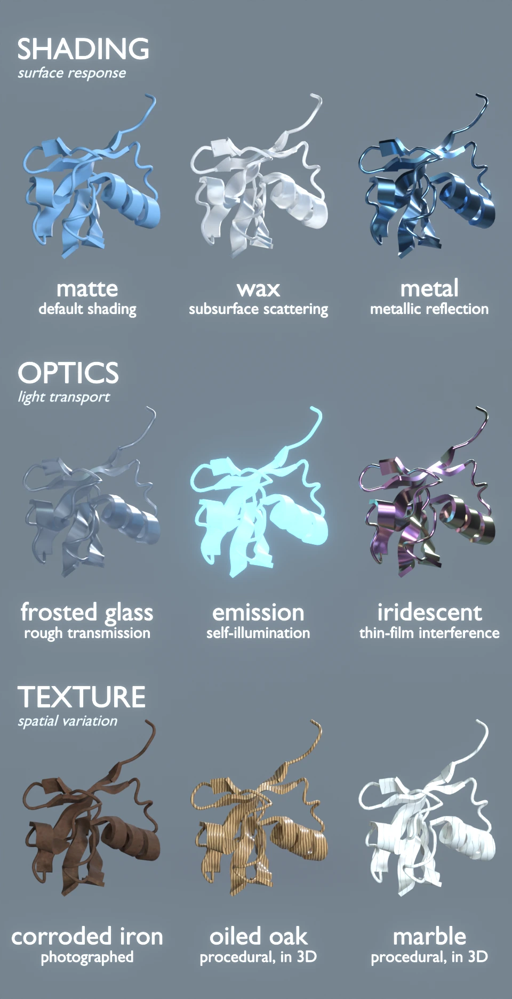

`11_material_gallery.py` — the same ubiquitin nine times, differing in nothing
but what it is made of: same camera, same lights, same coordinates. Each copy
shares the mesh and gets its own node group, which is what makes nine materials
possible on one molecule.

They are grouped, because "material" covers three questions that are not the
same question. **Shading** is the Principled BSDF's own lobes — matte, wax,
metal. **Optics** is what a diffuse-plus-specular model cannot do at all: light
going through the surface, light made by it, and light interfering with itself
in a film a few hundred nanometres thick. **Texture** is photographs of real
surfaces, from [Poly Haven](https://polyhaven.com)'s CC0 library — corroded
iron, oiled oak, weathered marble, in a ramp from dark and organic to pale and
mineral.

Four of the cells took more than picking a preset:

- **Wax** looked identical to matte until `subsurface_scale` was raised.
  Blender multiplies the scattering radius by a scale defaulting to 0.005
  units — 5 mm in a scene built at human scale, half an ångström in one built
  at Molecular Nodes'. Light that penetrates half an ångström does not visibly
  penetrate anything, so subsurface scattering was inert at molecular scale
  whatever weight it was given.
- **Emission** reads as a light source rather than as pale plastic because it
  is brighter than anything the lamps produce — bright enough to spill onto
  the backdrop — and because a Glare node thresholded above white blooms that
  cell and no other.
- **Iridescent** is `Thin Film Thickness` over metal: Cycles computes the
  interference between light reflected off the top of the film and off the
  bottom, so the colour depends on viewing angle and sweeps across the ribbon
  on its own. Nothing in a base-colour-and-roughness model reproduces it.
- **Marble and oak are procedural**, and the reason is worth the space.

### Why the stone and the wood are not photographs

Every scale on the sheet is worked out from one decision: the fold is lit and
framed as though it were an object you could pick up, so twenty-five ångström
of ubiquitin stands in for about fifteen centimetres of something in your
hand. That fixes how big its materials should be.

Poly Haven publishes the real-world size of every texture, and those numbers
are the problem. `rust_coarse_01` is 2.2 metres of wall; `marble_cliff_01` is
4.3 metres of quarry face. Asking a 4.3 metre photograph to clothe a
hand-sized object means using three per cent of it, and three per cent of a 2k
image is sixty pixels across the molecule. That is why photographic marble was
simultaneously *too busy* and short of veins: a wildly magnified crop of stone
that is mostly uniform anyway. Polished marble, granite and marble tiling were
each tried across a range of scales and bump strengths, and none of them
survives it.

A procedural field has no tile and no resolution. The marble and the oak are
built as a distorted three-dimensional band field evaluated in **object
space**, so the surface does not carry the texture — it cuts through it. A
vein does not stop at a silhouette and resume somewhere unrelated on the far
side; it continues through the body of the molecule. Colour, roughness and
relief all read from the same field, so where the vein is, the stone changes
colour, takes light differently and stands slightly proud. Vein spacing is set
in millimetres of the object as held, not in tiles.

The corroded iron stays photographic, at its published tile size, to show that
route honestly — including how soft it goes at this magnification.

The textures are fetched on first run into `build/textures` and cached;
nothing is committed, and a run without network draws the first two bands and
reports what it could not reach. At the width the documentation uses each cell
is about three hundred pixels, which is enough to tell nine materials apart
and not enough to see what any of them is doing — so `make
vignettes-gallery-detail` renders the same sheet at figure width:

[**The sheet at 2000 px**](images/11_material_gallery_detail.webp), where the
grain of the oak and the veins in the marble are there to be looked at. This is also the one vignette that renders
onto a backdrop rather than onto alpha, because metal is mostly a picture of
its surroundings and frosted glass is largely a picture of what is behind it —
both are black over nothing.

### 12. Procedural shading

| The Gala material | The same, with three nodes added |
| --- | --- |
| 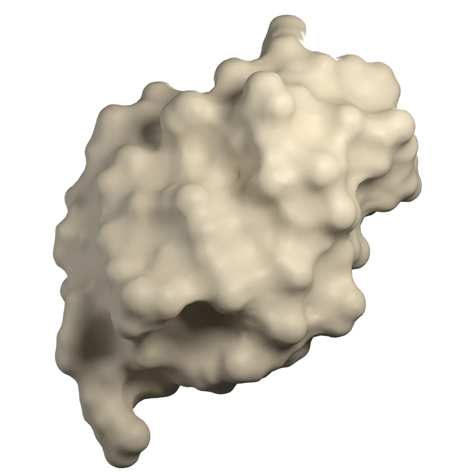 | 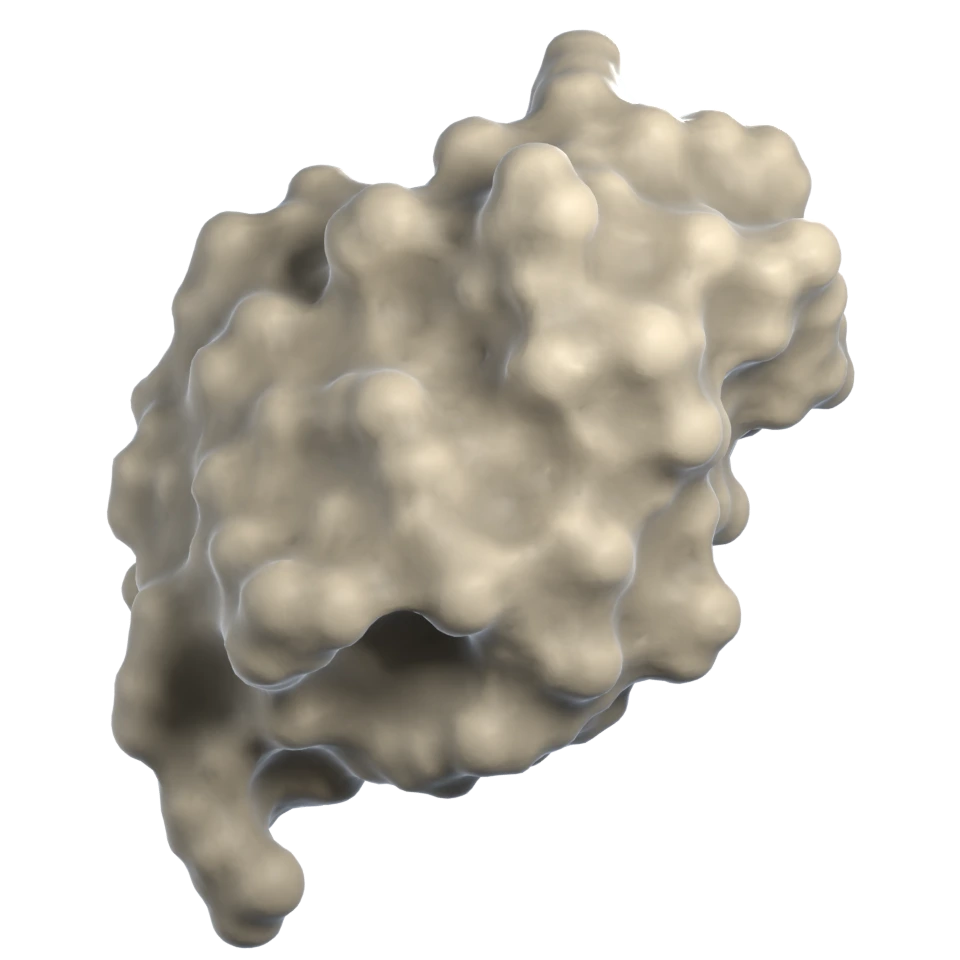 |

`12_procedural_shading.py` — `build_material` returns a node tree, and the
shader editor is where the rest of Blender's texturing lives. Three additions
to it, on a lysozyme surface: **Pointiness** into the base colour, which
darkens the crevices and is what makes a molecular surface read as carved
rather than drawn; a **noise texture through a Bump node**, for a grain finer
than the geometry; and a **Fresnel term into emission**, which puts a light
edge on the silhouette without an outline drawn over it.

None of the three touches colour in the sense that matters — they multiply and
add to whatever is already in Base Color, so a pLDDT band or a chain rainbow
underneath still means what its legend says.

## Animation

### 13. A conformational morph

| Open (4AKE) | Closed (1AKE) |
| --- | --- |
| 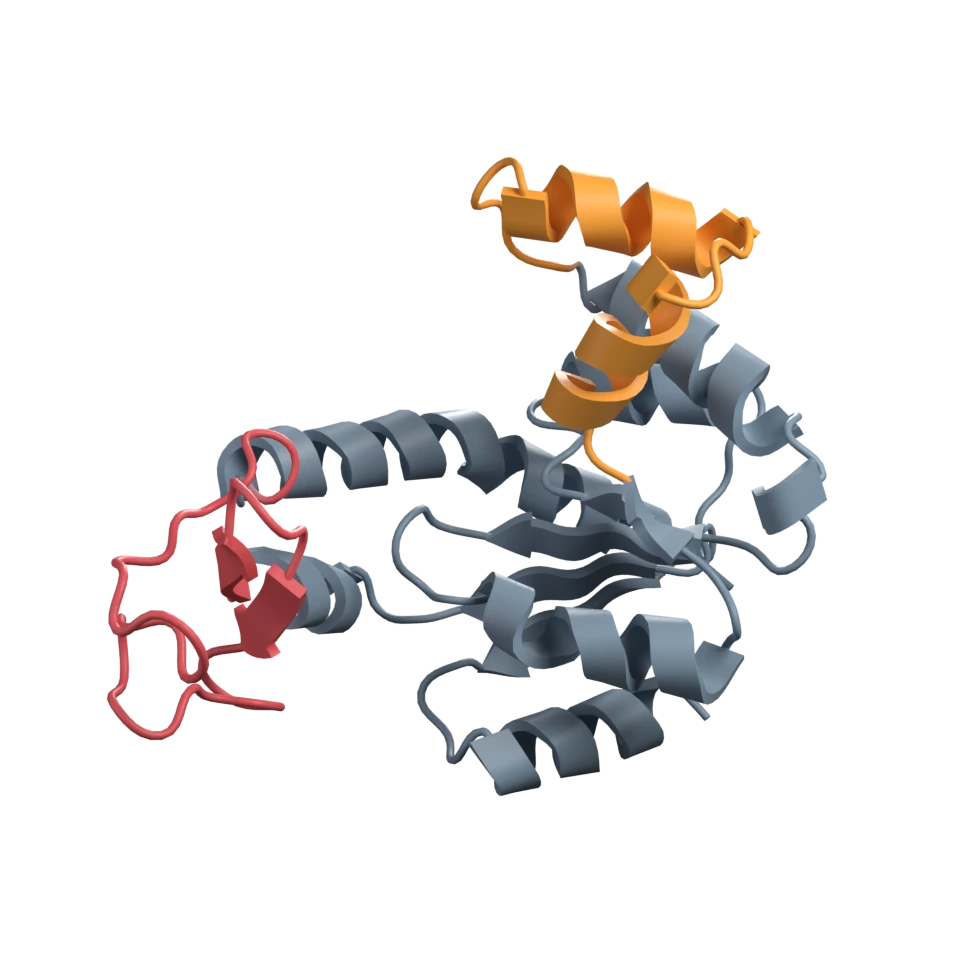 | 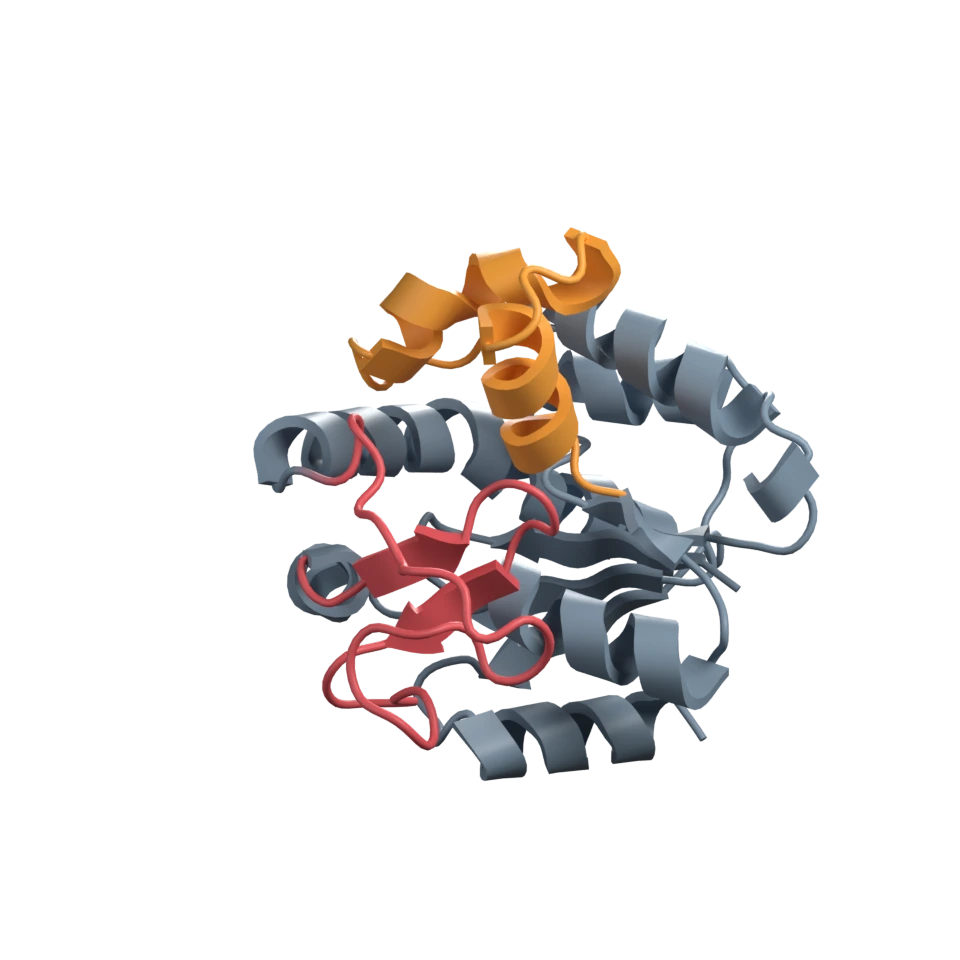 |

`13_conformational_morph.py` — adenylate kinase closing on its substrate,
animated with a **shape key**: a second set of vertex positions and a slider
between them. Shape keys are evaluated before modifiers, so Molecular Nodes
rebuilds the cartoon from the interpolated coordinates on every frame — the
ribbon is re-derived rather than deformed.

What makes it mean anything is the superposition. Fitting on the CORE domain
alone leaves the LID travelling 14.7 Å and the NMP-binding domain 10.5 Å;
fitting on everything would smear that across the whole molecule. The molecule
is then turned so the LID's mean displacement lies across the frame, because a
domain closing towards the camera closes by a few pixels.

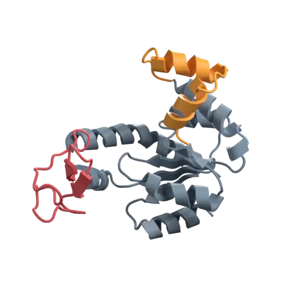

The whole motion, from `make vignettes-morph`: fifty frames at 25 fps, out and
back, so it loops. Watch the ribbon rather than the shape — the secondary
structure holds all the way through because Molecular Nodes re-derives it at
every frame from the interpolated atoms.

### 14. A camera move and a focus pull

| Wide | Close |
| --- | --- |
| 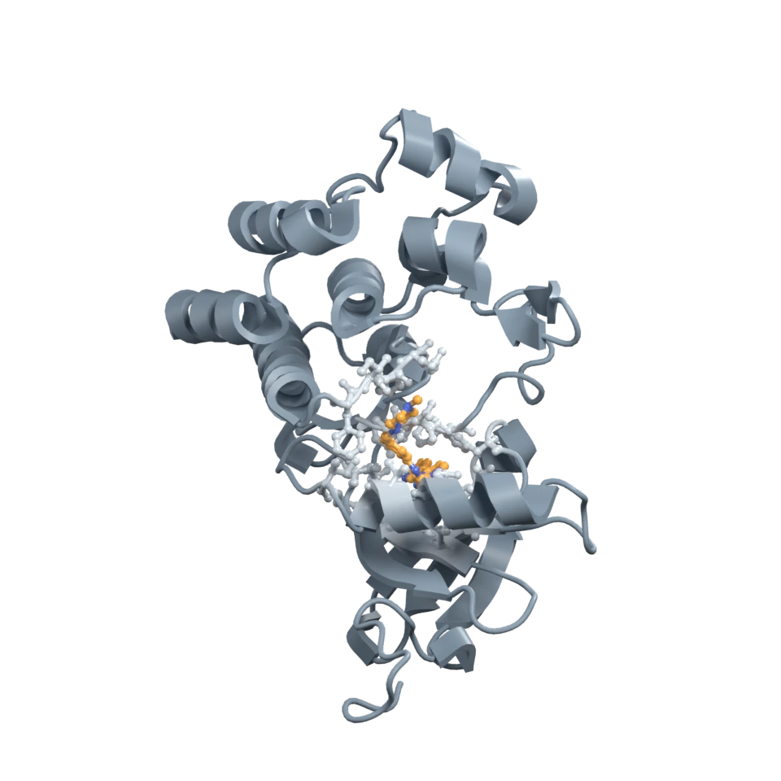 | 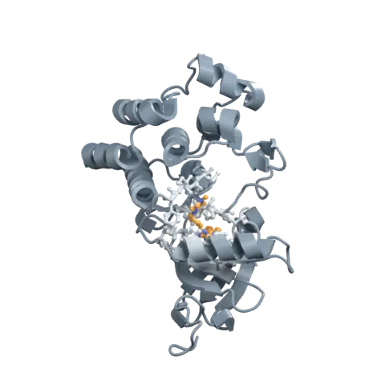 |

`14_focus_pull.py` — from an establishing shot of the Abl kinase domain to a
close-up on imatinib in its pocket, without a cut. Both poses are computed
rather than placed: `frame_target` takes a `selection`, so "frame the kinase"
and "frame the drug" are the same call twice, and the vignette keyframes
between where each one put the camera.

The camera's rotation is not animated at all. Keyframing it at the two ends
and letting Blender fill in between is the obvious approach and it fails on a
swing this wide: position interpolates along the chord between the poses while
orientation interpolates separately as Euler angles, so half way through the
move the camera is somewhere the rotation was never computed for and the
molecule swings out of frame and back. A Track To constraint aimed at a target
that slides from the middle of the protein to the middle of the drug removes
the question — the rotation is derived every frame, and the same target takes
the focus, so that cannot drift either.

What is keyframed is where the camera stands, sampled along an arc about the
molecule rather than straight across it: the viewing direction slerped, the
distance interpolated geometrically, the easing baked into which fractions are
sampled so twelve keys do not ease into and out of each other. The aperture
opens from f/8 to f/4 on the way in.

The close-up swings 73 degrees left of the wide shot rather than pushing
straight in, and that is the whole shot: imatinib is a long molecule threaded
through the cleft between the two lobes, and from anywhere near the wide angle
it points at the camera and projects to an orange knot. From the left it lies
across the frame at full length. The lens is a 200 mm and does not change
during the move — a shot that changes focal length is a zoom — which also buys
the close-up its framing from three times the distance, leaving most of the
foreground that would otherwise blur across it outside the cone entirely.

It also fixes the thing that catches everyone: `frame_target` sets the clipping
planes for the pose it just computed, and a camera that moves needs a range
covering the whole move. And because interpolating two poses moves the camera
along the chord between them rather than around the arc, the vignette checks
that the chord clears the molecule instead of flying through it.


The move itself, from `make vignettes-focus-pull`.

## Artistic

### 15. A designed protein


`15_designed_protein.py` — Top7, the first protein designed with a fold that
had never been observed in nature, lit the way a design lab lights one for a
press release: dark set, two opposed coloured rims, a world volume for the
light to travel through, depth of field, and bloom from a Glare node in the
compositor.

Every other vignette here is a figure and renders onto alpha. This one is the
other job — *what is this thing*, rather than *what does this measurement
show* — and the background is part of the picture.

### 16. A crowded cytoplasm

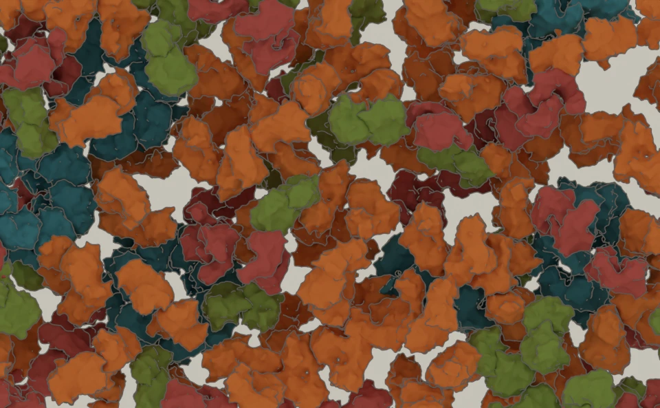

`16_crowded_cytoplasm.py` — after David Goodsell: flat colour, ink outlines,
everything at one scale, and no empty space. Four *E. coli* proteins in
roughly their relative abundance, instanced through a slab by picking one of
four sources per point, drawn with **Freestyle** — Blender's line renderer —
through an **orthographic camera**, so a molecule at the back is the same size
as one at the front.

Freestyle is what makes the style, and it is also what makes this the most
expensive figure here: it builds a view map over every triangle it can see, and
there are a hundred and twenty molecules. The surfaces are therefore built at
`quality=1` — at the default this scene peaks at 23 GB and is killed on a 16 GB
CI runner, and at `quality=1` it peaks at 6.6 GB. Across molecules a few
hundred pixels wide the two are indistinguishable, because the outline is doing
the work rather than the tessellation.

The packing is quantitative: positions are rejection-sampled with each
species' own exclusion radius and the vignette reports the volume fraction it
reached. It lands near 10% against the 20-30% of real cytoplasm, and the
reason is worth knowing — a protein's bounding sphere is several times the
protein, so packing spheres jams long before a cell does. Real molecules
interlock, which is what purpose-built packers model and what shrinking the
exclusion radius here stands in for.
