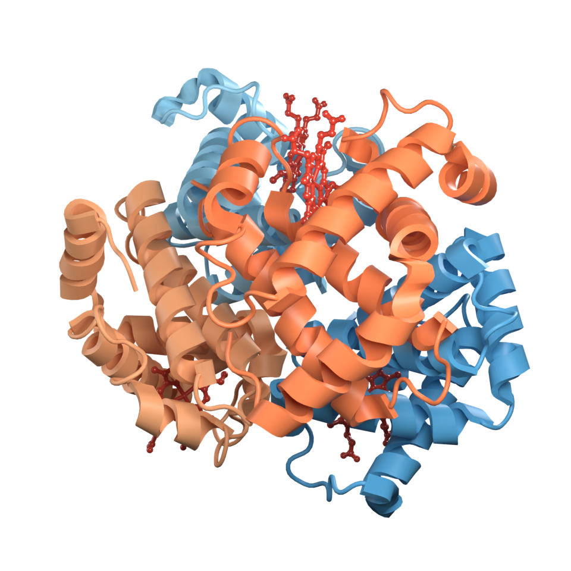
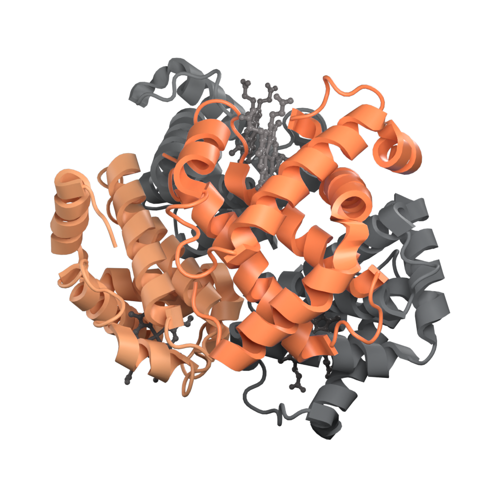
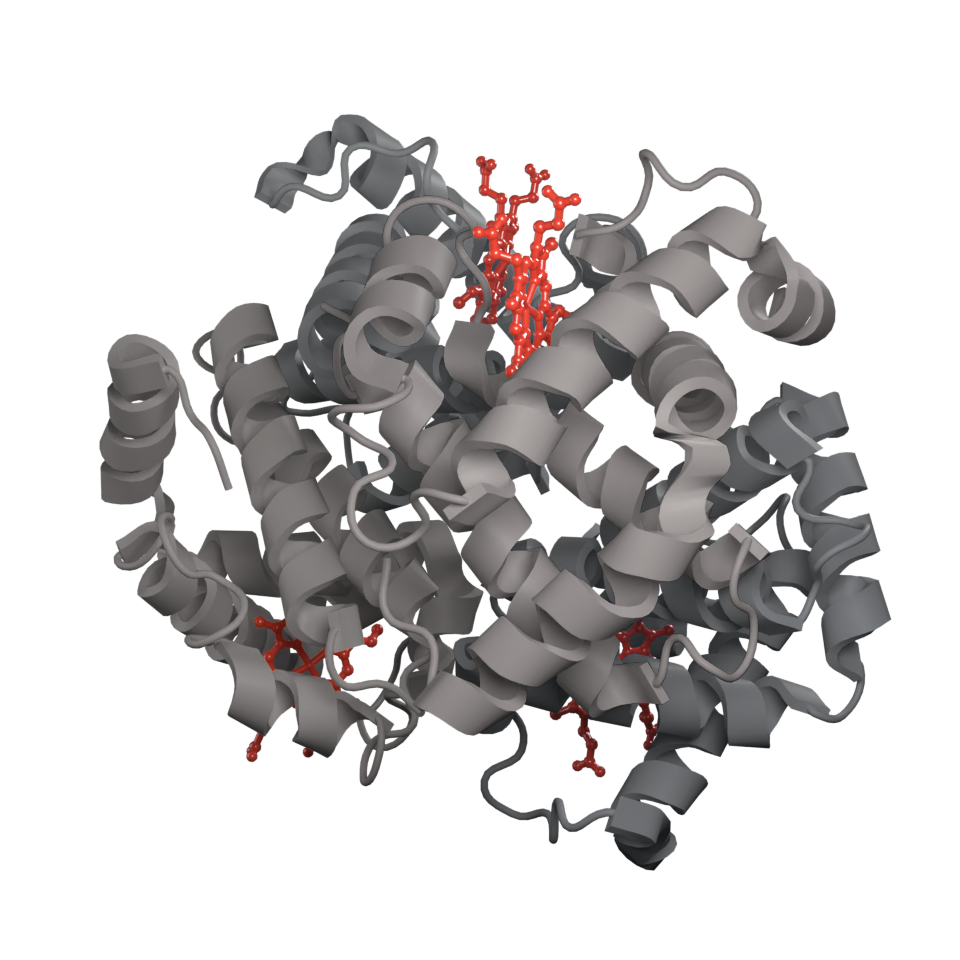

# Vignettes

Runnable end-to-end examples. Each is a standalone script in
[`vignettes/`](https://github.com/maomlab/blender_gala/tree/main/vignettes)
that CI executes on every push, so none of them can drift from the code.

Run one:

```bash
blender --background --python vignettes/01_publication_figure.py
```

or all of them:

```bash
make vignettes
```

They write their output into `docs/images/`.

## 1. A publication figure


`01_publication_figure.py` — load a structure, style it, and go from the
default scene to a transparent-background 300 dpi figure in one
`publication_setup` call. Shows the render preset, the lighting rig and the
report it returns.

## 2. A binding site


`02_binding_site.py` — find every interaction between a ligand and its pocket,
draw them as dashed lines, quote the polar distances, and label the closest
residues on translucent cards. A cool neutral protein against warm ligand
carbons, so the eye goes where the figure is about, and the contacting residues
as ball-and-stick at half the ligand's radii and coloured by element, so the
dashes land on atoms you can identify without competing with the ligand. The camera looks in along the direction the
pocket opens, computed from the structure, and frames the site rather than the
protein. The full Objective 2 workflow.

## 3. Measuring


`03_measurements.py` — the distance that decides whether a GPCR is activated.
Aranda-García et al.
([Nat Commun 16, 2020](https://doi.org/10.1038/s41467-025-57034-y)) define the
state of a class A receptor by the distance between two alpha carbons, one on
TM2 and one on TM6, and give the thresholds that sort a structure into closed,
intermediate or open. The vignette measures exactly that on the adenosine A2A
receptor in both states — 5UIG with an antagonist bound, 6GDG coupled to
mini-Gs — superposing them with Kabsch onto a common frame first, so what is
left is the receptor's own motion: 12.70 Å closed, 17.59 Å open, TM6 out by
4.9 Å. Drawn in the paper's own orientation — a side view in the membrane
plane, helices vertical, TM6 on the left and TM2 on the right — built from the
bundle's principal axis rather than from whichever way the crystals point. It also shows what happens when a selection is ambiguous, and how
`measure` dispatches on two, three or four atoms to give a distance, an angle
or a dihedral.

## 4. AlphaFold confidence


`04_alphafold_confidence.py` — fetch human p53 from the AlphaFold database,
colour it by pLDDT with the official confidence bands, print the legend, and
render only the parts worth trusting. A real prediction rather than a fixture,
because the point of the bands is that confidence is uneven: p53's DNA-binding
core comes out dark blue and its disordered arms orange.

## 5. Compositing passes


`05_compositing_passes.py` — haemoglobin rendered once, cut into four figures.
A talk needs the same picture with a different subunit carrying the argument
each time, and rendering it once per slide is three more chances for the
lighting or the framing to drift. So the vignette gives each chain its own
material — which is what lets cryptomatte tell them apart inside a single
Molecular Nodes object — enables the passes, and writes the render to a
multilayer EXR alongside the picture.

Everything after that is compositing. The alpha-subunit figure above, the beta
one and the heme one are all cut from that one render by
`highlight_matte`, in a scene with no molecule, no lights and no camera in it:
every pixel comes out of the EXR, and each figure costs a fraction of a second
rather than another pass through Cycles.

| The render | Beta subunits | The hemes |
| --- | --- | --- |
|  |  |  |

It also sets up depth of field, and renders the one variant that cannot be done
after the fact — depth cueing, which needs the Z pass at render time. The
[compositing guide](guide/compositing.md) shows the node graphs behind all of
it.

## 6. A turntable


`06_turntable.py` — an orbiting animation with framing that holds for every
frame. The camera is parented to a pivot at the molecule's centre and the
lights are not, so the structure turns *through* the light rather than being lit
identically from every angle, which is what makes its shape read.

The animation above is the turn itself — 60 frames at 25 fps, in WebP rather
than GIF so that it keeps a real alpha channel and the full colour range at a
fraction of the size. It is built by `make turntable`, which is not part of
`make vignettes`: a hundred-odd Cycles frames is more than a smoke test on
every push should be doing.

## 7. Electrostatics


`07_electrostatics.py` — barnase and barstar, each solved on its own with
PDB2PQR and APBS, then opened out like a book so both binding faces are in
view. Barnase's is a patch of positive, barstar's is a patch of negative, and
the two are shaped like each other — which is why they associate as fast as
they do. The vignette also puts a number on it: the mean potential over each
partner's interface against the mean over the rest of its surface.

The surface is thin glass rather than an alpha-blended film, with the cartoon
underneath showing through it and refracted by it, and Cycles' caustics turned
on so the key light focuses through the shell onto the fold inside. That is
the argument for rendering a molecule in a path tracer rather than a viewer:
the same map, lit rather than drawn. Needs `apbs` and `pdb2pqr`;
`pip install apbs-binary pdb2pqr`, or `make apbs`.

## 8. PyMOL sessions


`08_pymol_session.py` — the round trip. It reads a session PyMOL itself wrote
(the one the tests use), reports what is in it without needing PyMOL
installed, then builds a scene of adenylate kinase, writes it out as a `.pse`,
clears everything, and rebuilds the scene from that file alone.

The figure above is the rebuilt one: the cartoon, the ligand, the binding-site
colouring and the camera all came back out of the session. The vignette checks
the round trip rather than asserting it — atom count, largest positional
drift, largest colour change, and whether the B-factors survived — and prints
what a session cannot carry, which is the lighting and materials that made it
worth opening Blender.
